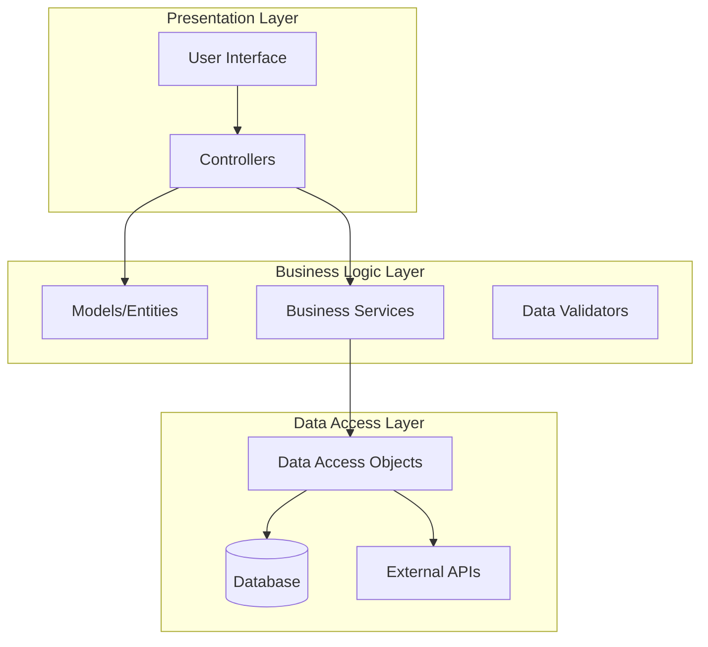
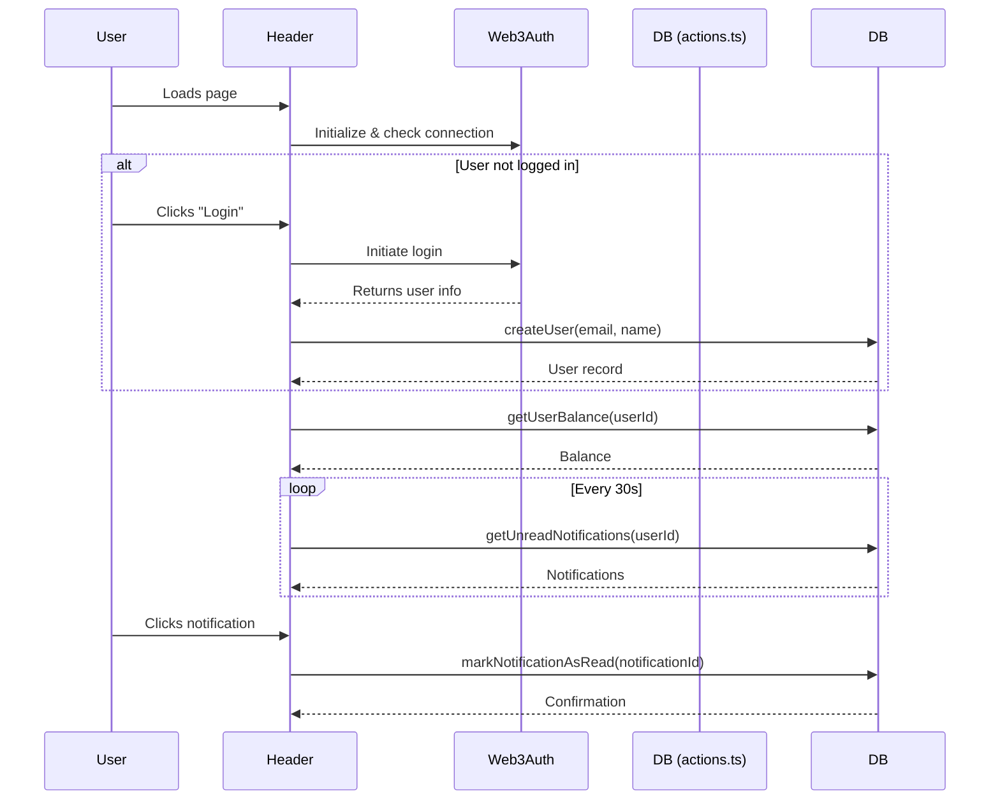

# EcoTrack (NUS Orbital Project)

EcoTrack, an AI-powered waste management platform.

Proposed level of achievement: Apollo 11

## Promotional Poster

## Proof-of-Concept : 
https://github.com/user-attachments/assets/7405a2f0-2817-4729-8379-8a0e70848eff

## Before using the app

### Limitations
🔍 1. AI Accuracy & Dependence
	•	Limitation: Reliance on Google Gemini AI for waste classification may lead to incorrect or biased predictions, especially for unclear images.
	•	Impact: Users may get inaccurate rewards or feedback, reducing trust in the system.

⚖️ 2. Verification Bottleneck
	•	Limitation: Waste report verifications may require human validation in some cases, especially for edge scenarios.
	•	Impact: Slows down the reward system and notification flow, reducing real-time effectiveness.

🔒 3. Web3Auth Adoption Barrier
	•	Limitation: Not all users (especially older or less tech-savvy ones) are comfortable with Web3 wallet-based authentication.
	•	Impact: Limits app accessibility and onboarding rate among the general population.

## Milestone 1 (Ideation)
### Motivation
EcoTrack aims to address these pain points by empowering both residents and municipal authorities with real-time data, actionable insights, and user-friendly tools to promote responsible waste disposal and recycling. It is designed to incentivize and streamline waste reporting and collection. Our goal is to create a community-driven approach to waste management, rewarding users for their eco-friendly
actions.

### Proposed core features
<table>
    <thead>
        <tr>
            <th>Features</th>
            <th>Description</th>
        </tr>
    </thead>
    <tbody>
        <tr>
            <td>User Authentication & Role Management </td>
            <td>Users (residents, collectors, administrators) can register and log in using web3 authentication.
              <ul>
                - Feature includes: 
                <ul>
                  <li>Wallet-Based Login where users connect via a Web3 wallet (e.g., MetaMask, Web3Auth). The app verifies wallet ownership using cryptographic signatures. No traditional passwords needed.</li>
                </ul>
            </td>
        </tr>
        <tr>
            <td>Waste Reporting & Image Upload</td>
            <td>Residents can report waste incidents by uploading photos, specifying waste type, and providing location details. Each report is tracked through various statuses (e.g., pending, collected, verified).
              <ul>
                - Feature includes: 
                <ul>
                  <li>	Users can take or upload a photo of the waste. Image is sent to the backend for storage and optional AI analysis.</li>
                  <li>Users select the type of waste (e.g., plastic, paper, organic, mixed). This input can be used to help train or supplement AI classification.</li>
                </ul>
            </td>
        </tr>
        <tr>
            <td>AI-Powered Waste Classification</td>
            <td>When users upload images, the system utilizes Google Gemini AI models to automatically classify the type of waste (e.g., plastic, paper, organic) and estimate its quantity, streamlining the reporting process.
              <ul>
                - Feature includes: 
                <ul>
                  <li>When a user uploads an image, the AI classifies the waste as plastic, paper, organic, etc and reduces manual input and errors from users.
</li>
                  <li>AI estimates the amount of waste (e.g., small/medium/large, or weight approximation) and helps improve reward fairness and collection planning.
</li>
                </ul>
            </td>
        </tr>
        <tr>
            <td>Reward Points System</td>
            <td>Users earn points for reporting waste and for successful verifications of waste collection. Points are tracked in user profiles and can be redeemed for incentives, encouraging active participation.
              <ul>
                - Feature includes: 
                <ul>
                  <li>Users earn points for submitting valid waste reports, reports that get verified as collected, participating in campaigns (e.g., clean-up events)</li>
                  <li>Each user’s total points are stored and updated in their profile. Their Points history (earned/redeemed) may also be viewable</li>
                  <li>Users can redeem points for eco-friendly rewards (e.g., vouchers, merchandise). Backend logic ensures only eligible users can redeem.</li>
                  <li>Points are automatically credited based on system triggers (e.g., verified status). Admins can manually adjust points if needed.</li>
                </ul>
            </td>
        </tr>
        <tr>
            <td>Real-Time Notifications</td>
            <td>Users and authorities receive notifications for verified waste collection.
              <ul>
                - Feature includes: 
                <ul>
                  <li>Users receive a notification when their reported waste has been verified as collected. Authorities/collectors also get notified when a report status changes to “verified.”</li>
                  <li>Users can view past notifications in a timeline or activity feed.</li>
                  <li>Notification center or banner inside the dashboard to show recent updates.</li>
                </ul>
            </td>
        </tr>
        <tr>
            <td>Gamified Leaderboard & Achievements</td>
            <td>A public leaderboard ranks users based on points earned, and achievements or badges are awarded for milestones, fostering friendly competition and community engagement.
              <ul>
                - Feature includes: 
                <ul>
                  <li>Displays top users ranked by total points earned. Can be filtered by time (e.g., weekly, monthly, all-time).
</li>
                  <li>Leaderboard updates in real-time or at fixed intervals after actions like report verification.</li>
                </ul>
            </td>
        </tr>
    </tbody>
</table>

## User Stories
As a resident who wants to contribute to a cleaner neighborhood, I want to easily report overflowing or illegal waste via the app, so that authorities can respond quickly and efficiently.

As a resident who recycles regularly, I want to track my recycling habits and see my progress, so I can stay motivated and improve my environmental impact.

As a busy user, I want to receive timely notifications about waste collection schedules and recycling drives, so I never miss important dates or opportunities to participate.

As a waste collector, I want to view optimized collection routes and real-time bin fill levels, so I can make my rounds more efficiently and avoid unnecessary trips.

As a municipal officer, I want to access analytics and reports on waste generation and recycling rates, so I can make informed decisions about resource allocation and public outreach.

As a community leader, I want to organize local clean-up events and track participation through the app, so I can foster greater community involvement.

As a user with limited technical skills, I want the app to have an intuitive interface and clear instructions, so I can be incentivised to use the app.

As a resident who sometimes forgets to sort waste properly, I want the app to provide educational content and AI-powered waste classification, so I can learn and improve my
sorting habits.

## Software Engineering Practices and Design 

### Software Engineering Practices 
**Primary Architecture: N-tier Architecture with MVC Pattern**

For EcoTrack (an environmental tracking application), we aim to implement a **3-tier layered architecture** combined with the **Model-View-Controller (MVC)** pattern:

## Design Patterns

### 1. **Model-View-Controller (MVC)**
- **Models**: Represent environmental data (carbon footprint, energy usage, waste tracking)
- **Views**: User interfaces for data input/visualization 
- **Controllers**: Handle user interactions and coordinate between models and views

### 2. **Observer Pattern**
- Perfect for real-time environmental data updates
- Notify users when thresholds are exceeded (e.g., high carbon footprint)
- Update dashboards automatically when new data is added

### 3. **Command Pattern**
- Implement undo/redo functionality for data entry
- Track user actions for audit purposes
- Useful for batch operations (bulk data import/export)

### 4. **Factory Pattern**
- Create different types of environmental trackers (energy, transportation, waste)
- Generate appropriate calculators based on data type
- Support multiple calculation methodologies

### 5. **Strategy Pattern**
- Different calculation algorithms for carbon footprint
- Multiple data export formats (PDF, CSV, JSON)
- Various visualization types (charts, graphs, reports)

### Sequence Diagram

### Class Diagram

### Summary

## Timeline and Development Plan 
## 📅 EcoTrack Development Timeline & Milestones

| **Milestone** | **Due Date** | **Phase** | **Deliverables** | **Status** | **Features** |
|---------------|--------------|-----------|------------------|------------|--------------|
| **Milestone 1** | **June 2, 2024** | **Technical Proof of Concept** | Minimal Working System | **COMPLETED** | • Web3Auth user authentication • Basic home page & dashboard • Waste reporting with image upload • Database integration (PostgreSQL + Drizzle) • Responsive UI components |
| **Milestone 2** | **June 30, 2024** | **Core Prototype** | Working System with Core Features | **NOT COMPLETED** | • AI-powered waste verification • Rewards points system • Real-time push notifications • User balance tracking • Report status management |
| **Milestone 3** | **July 28, 2024** | **Extended System** | Full-Featured Application | **NOT COMPLETED** | • Interactive leaderboard & achievements • Admin dashboard & analytics • System optimization & user testing • Bug fixes & UX improvements • Performance enhancements |

## 🚀 Feature Implementation Progress

### **Milestone 1 - Technical Proof of Concept** 
- **Authentication System**: Web3Auth integration with wallet-based login
- **Frontend Foundation**: Next.js 15 with TypeScript and Tailwind CSS
- **Database Layer**: PostgreSQL with Drizzle ORM, normalized schema
- **Core UI Components**: Responsive design with shadcn/ui components
- **Image Upload**: Integrated waste reporting with photo capture

### **Milestone 2 - Core Prototype** 
- **AI Verification**: Smart waste classification and validation system
- **Rewards Engine**: Point-based incentive system with balance tracking
- **Notification System**: Real-time updates for user actions and rewards
- **Data Management**: Comprehensive reporting and tracking features
- **User Experience**: Polished interface with loading states and error handling

### **Milestone 3 - Extended System** 
- **Gamification**: Leaderboard system with user rankings and achievements
- **Analytics Dashboard**: Admin interface for system monitoring and insights
- **Optimization**: Performance improvements and user feedback integration
- **Testing & Refinement**: Bug fixes, UX enhancements, and system stability
- **Mobile Responsiveness**: Cross-device compatibility and touch optimization

## Project Logging
https://docs.google.com/spreadsheets/d/1qt2mJ2I-7t5aVOVSAWLBEEHEN_XpdWWZP9iVdjLWB6Y/edit?gid=0#gid=0
