# EcoTrack (NUS Orbital Project)

EcoTrack, an AI-powered waste management platform.

Proposed level of achievement: Apollo 11

## Promotional Posters

<!-- Liftoff -->
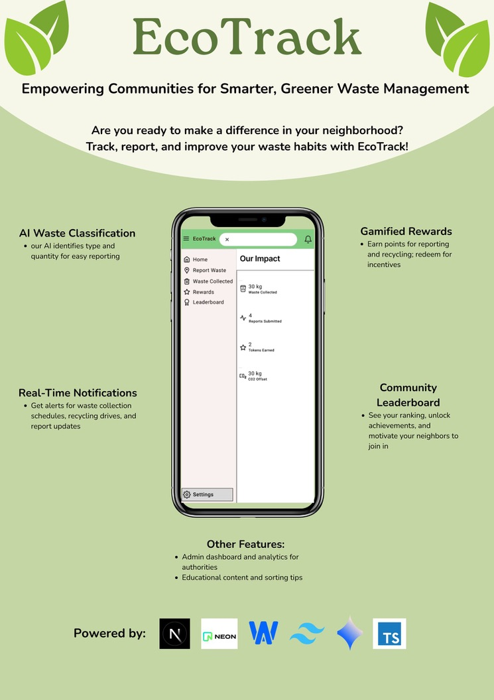

<!-- Milestone 1 -->

<!-- Milestone 2 -->

<!-- Milestone 3 -->

## Promotional Video :

https://github.com/user-attachments/assets/7405a2f0-2817-4729-8379-8a0e70848eff

## Before using the app

### Limitations

🔍 1. AI Accuracy & Dependence
• Limitation: Reliance on Google Gemini AI for waste classification may lead to incorrect or biased predictions, especially for unclear images.
• Impact: Users may get inaccurate rewards or feedback, reducing trust in the system.

⚖️ 2. Verification Bottleneck
• Limitation: Waste report verifications may require human validation in some cases, especially for edge scenarios.
• Impact: Slows down the reward system and notification flow, reducing real-time effectiveness.

🔒 3. Web3Auth Adoption Barrier
• Limitation: Not all users (especially older or less tech-savvy ones) are comfortable with Web3 wallet-based authentication.
• Impact: Limits app accessibility and onboarding rate among the general population.

## Milestone 3 (Polishing)

### Motivation

Singapore faces growing challenges in waste management due to rising urbanization and consumption.
Common issues include:

<ul>
<li>Low Recycling Rates: Many residents are unsure about proper recycling practices, leading to contamination and reduced recycling efficiency.
</li>
<li>Inefficient Collection: Waste bins often overflow or are collected when not full, resulting in resource wastage.
</li>
<li>
Lack of Engagement: Residents have limited visibility into their waste habits and few incentives to improve them.
</li>
</ul>
EcoTrack, an AI-powered waste management platform aims to address these pain points by empowering both residents and municipal authorities with real-time data, actionable insights, and user-friendly tools to promote responsible waste disposal and recycling. It is designed to incentivize and streamline waste reporting and collection. Our goal is to create a community-driven approach to waste management, rewarding users for their eco-friendly actions.

### Aim

We aim to allow residents to track their waste disposal and recycling habits, provide timely reminders and educational content to encourage correct recycling. At the same time, we also aim to enable authorities to monitor bin fill levels and optimize collection routes and engage users through gamification and community leaderboards to foster sustainable habits. EcoTrack will empower Singapore’s residents and authorities to collaboratively improve waste management practices. By combining education, data-driven insights, and gamification, our app aims to make sustainability a daily habit for all.

### User Stories

As a resident who wants to contribute to a cleaner neighborhood, I want to easily report overflowing or illegal waste via the app, so that authorities can respond quickly and efficiently.

As a resident who recycles regularly, I want to track my recycling habits and see my progress, so I can stay motivated and improve my environmental impact.

As a busy user, I want to receive timely notifications about waste collection schedules and recycling drives, so I never miss important dates or opportunities to participate.

As a waste collector, I want to view optimized collection routes and real-time bin fill levels, so I can make my rounds more efficiently and avoid unnecessary trips.

As a municipal officer, I want to access analytics and reports on waste generation and recycling rates, so I can make informed decisions about resource allocation and public outreach.

As a community leader, I want to organize local clean-up events and track participation through the app, so I can foster greater community involvement.

As a user with limited technical skills, I want the app to have an intuitive interface and clear instructions, so I can be incentivised to use the app.

As a resident who sometimes forgets to sort waste properly, I want the app to provide educational content and AI-powered waste classification, so I can learn and improve my
sorting habits.

## Features

### 1. User Acount Authentication

---

#### Description

As EcoTrack is a personalized waste management and rewards platform, each user must be authenticated with a unique account.
EcoTrack implements a Web3 wallet-based authentication system using Web3Auth, allowing users to:

- Log in using a Web3 wallet (e.g., Google, Facebook, or other OAuth providers via Web3Auth)

- Create an account automatically on first login (no manual registration required)

- Securely store user identity and session using cryptographic signatures

- Log out and clear session data

Upon successful authentication, the user's information (email, name, wallet address) is retrieved and stored in the database if not already present. All authentication and user management logic is handled via the Web3Auth SDK and backend API calls.

---

#### Implementation Philosophy

Implementation Philosophy
EcoTrack’s authentication flow is designed for seamless onboarding and security:

- On app load, the authentication controller checks if the user is already logged in via Web3Auth.

- If the user is authenticated, their profile is fetched (or created if new) and stored in the app state.

- If not authenticated, the user is prompted to log in via Web3Auth’s modal, supporting multiple OAuth providers and wallets.

- After login, the app ensures a user profile exists in the database (creating one if needed).

- The user is then routed to the main dashboard.

- All authentication errors (e.g., network mismatch, failed login) are caught and displayed to the user via toast notifications.

- The authentication state is monitored, and users are redirected to login if their session expires.

- This approach ensures that every user has a unique, secure account, and onboarding is as frictionless as possible, leveraging modern Web3 standards.

---

#### Implementation Challenges

For user authentication, the key issue we faced was network mismatch and configuration. Enusring the Web3Auth client ID and network configuartion match the project's setting was quite difficult and we kept facing usses where the wallet was not being initialised, leading to failed logins. Additionally, handling session persistence and automatic re-authentication required careful integration with Web3Auth's SDK and local storage.

---

#### Diagrams

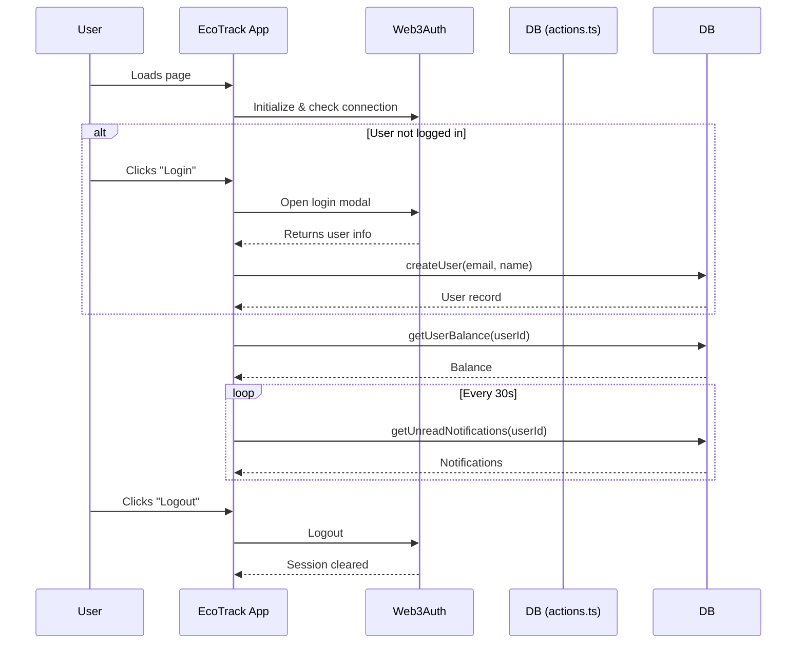
```mermaid
sequenceDiagram
    participant User
    participant EcoTrack App
    participant Web3Auth
    participant DB (actions.ts)

    User->>EcoTrack App: Loads page
    EcoTrack App->>Web3Auth: Initialize & check connection
    alt User not logged in
        User->>EcoTrack App: Clicks "Login"
        EcoTrack App->>Web3Auth: Open login modal
        Web3Auth-->>EcoTrack App: Returns user info
        EcoTrack App->>DB: createUser(email, name)
        DB-->>EcoTrack App: User record
    end
    EcoTrack App->>DB: getUserBalance(userId)
    DB-->>EcoTrack App: Balance
    loop Every 30s
        EcoTrack App->>DB: getUnreadNotifications(userId)
        DB-->>EcoTrack App: Notifications
    end
    User->>EcoTrack App: Clicks "Logout"
    EcoTrack App->>Web3Auth: Logout
    Web3Auth-->>EcoTrack App: Session cleared
```

<p align="center">
    <p align="center">
        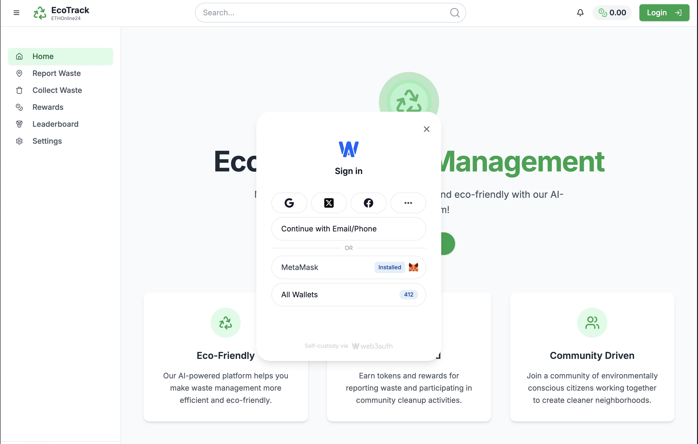<br>
        <em>Login Modal</em>
    </p>
    <br>
    <p align="center">
        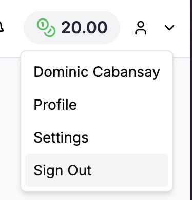<br>
        <em>Sign Out</em>
    </p>
</p>

---

### 2. Waste Reporting and Image Upload

---

#### Description

EcoTrack allows users to report waste incidents by uploading images and specifying where the waste was found. The reporting process is designed to be straightforward:

- Users can upload a photo of the waste (from their device or by taking a new photo).
- Users provide the location where the waste was found, either by entering an address.
- Each report includes the image, location, and the waste type (after AI verification), and is stored in the database with a status (e.g., pending, collected).
- Upon successful submission, users receive confirmation and may be awarded points as part of the rewards system.

All image uploads and report submissions are handled via the Next.js frontend, with backend logic in `/utils/db/actions.ts` and API routes for database integration.

---

#### Implementation Philosophy

The waste reporting and image upload feature is designed for simplicity and accessibility:

- Users only need to provide an image and location, lowering the barrier to reporting.
- The UI guides users through uploading an image and specifying the location in a few easy steps.
- All reports are validated before submission, ensuring required fields (image, location) are present.
- Users receive immediate feedback on the status of their report submission via toast notifications.
- The reporting logic is integrated with the rewards and notification systems, so users are incentivized and kept informed.

The frontend checks for user authentication before allowing report submission. If the user is not logged in, they are prompted to authenticate first. The backend ensures that each report is associated with a valid user and that all required data is stored securely.

---

#### Implementation Challenges

As this section was one of the first features implemented in EcoTrack, we encountered a variety of setbacks and technical challenges throughout the development process.

The first major challenge was designing a suitable data structure for storing waste reports and handling image uploads. Since EcoTrack uses Neon as its database, we needed to ensure that each report could efficiently reference its associated image, user, and location data. As we did not use any cloud storage service, images were stored directly as base64-encoded strings within the database itself. This approach simplified the architecture but required careful consideration of database performance and storage limits.

Another significant issue was handling the asynchronous nature of image uploads and database writes. There were cases where the image upload would succeed but the database write would fail (or vice versa), leading to orphaned images or incomplete reports. To address this, we implemented atomic operations and transaction-like logic in our backend API. Only after a successful image upload would the report be created in the database, and any failures would trigger cleanup routines to remove unused images.

Managing location data also presented challenges. Some users denied location permissions, while others entered ambiguous or incomplete addresses. To overcome this, we provided multiple options for location input: users could use GPS or manually enter an address.

State management on the frontend was another hurdle, especially when users navigated away from the reporting page or experienced network interruptions. We initially faced issues where partially completed reports would be lost, or duplicate submissions would occur if users retried after a failure. To solve this, we implemented temporary local state caching and ensured that all required fields were validated before allowing submission.

Finally, authentication and access control required careful handling. We needed to ensure that only authenticated users could submit reports, but also wanted to maintain a smooth user experience. Our solution was to check authentication status before allowing access to the reporting page, and to redirect unauthenticated users to the login flow, preserving their progress so they could resume reporting after logging in.

---

#### Diagrams

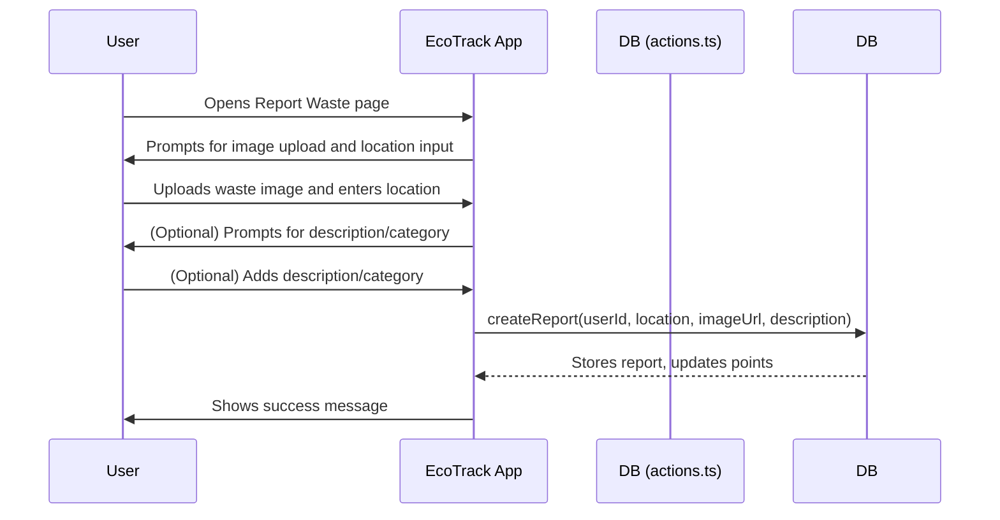
```mermaid
sequenceDiagram
    participant User
    participant EcoTrack App
    participant DB (actions.ts)

    User->>EcoTrack App: Opens Report Waste page
    EcoTrack App->>User: Prompts for image upload and location input
    User->>EcoTrack App: Uploads waste image and enters location
    EcoTrack App->>User: (Optional) Prompts for description/category
    User->>EcoTrack App: (Optional) Adds description/category
    EcoTrack App->>DB: createReport(userId, location, imageUrl, description)
    DB-->>EcoTrack App: Stores report, updates points
    EcoTrack App->>User: Shows success message
```

<p align="center">
    <p align="center">
        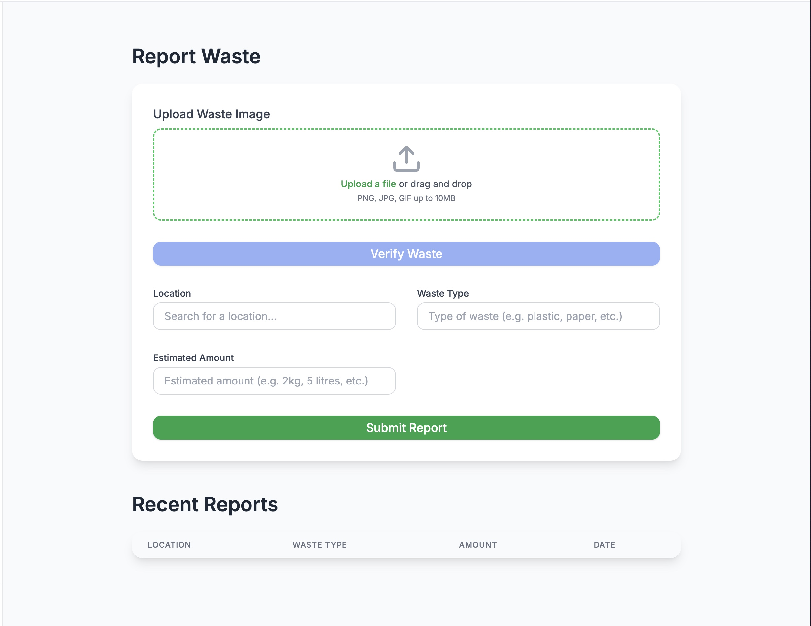<br>
        <em>Report Waste Page</em>
    </p>
    <br>
    <p align="center">
        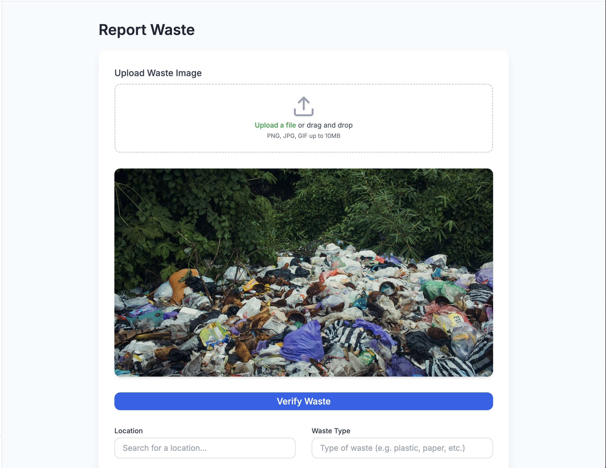<br>
        <em>Image Upload</em>
    </p>
        <p align="center">
        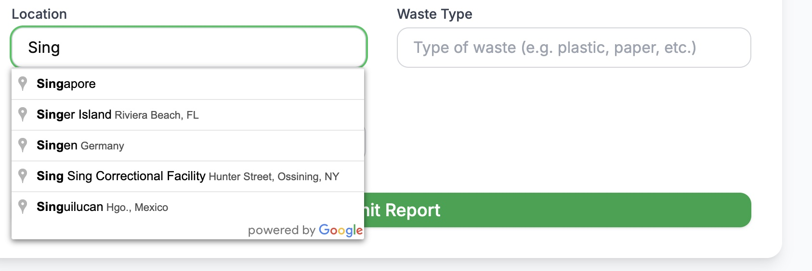<br>
        <em>Location Input</em>
    </p>
</p>

---

### 3. AI Verification of Waste Type

---

#### Description

EcoTrack leverages Google Gemini AI to automatically verify the type and estimated amount of waste from user-uploaded images. This feature streamlines the reporting process, reduces manual input, and improves data accuracy by providing AI-generated waste classifications and quantity estimates.

- Users upload a photo of the waste.
- Upon clicking "Verify Waste," the image is sent to Gemini AI for analysis.
- Gemini AI returns a JSON object containing the predicted waste type (e.g., plastic, paper), estimated quantity (e.g., 2kg, 5 litres), and a confidence score.
- The results are displayed to the user for review before final submission.
- The verified data is then included in the waste report stored in the database.

---

#### Implementation Philosophy

The AI verification feature is designed to minimize user effort and maximize data reliability:

- **Prompt Engineering:**  
  The prompt sent to Gemini AI is crafted to elicit structured, actionable responses. It instructs the AI to act as a waste management expert and to analyze the image for three key outputs: waste type, approximate quantity, and confidence level. The prompt explicitly requests a JSON response in the following format:
  ```json
  {
    "wasteType": "type of waste",
    "quantity": "approximate quantity",
    "confidence": confidence level (0-100)
  }
  ```

This ensures the AI’s output is easily parsed and directly usable in the app.

- The uploaded image is converted to a base64 string and sent as inline data to Gemini AI, ensuring compatibility and security.

- The verification process is triggered by a single button click. Users receive real-time feedback on the verification status (verifying, success, or failure) and can review the AI’s results before submitting their report.

- Only verified results (with all required fields present) are accepted for submission. If the AI response is malformed or missing data, the user is prompted to retry.

- The AI verification is tightly integrated with the reporting workflow, ensuring that only AI-verified data is stored in the database.

---

#### Implementation Challenges

Gemini AI sometimes returned responses with extra formatting (such as Markdown code blocks) or incomplete JSON, which caused parsing errors and disrupted the user flow. We tackled this by iteratively refining the prompt to be as explicit as possible, instructing the AI to respond only with a JSON object and nothing else. On the application side, we extracted only the JSON content. This included handling edge cases where the AI might return code fences or additional commentary.

---

#### Diagrams

<p align="center">
    <p align="center">
        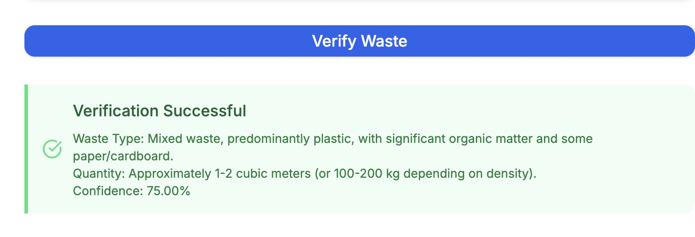<br>
        <em>Successful Waste Verification</em>
    </p>
    <br>
    <p align="center">
        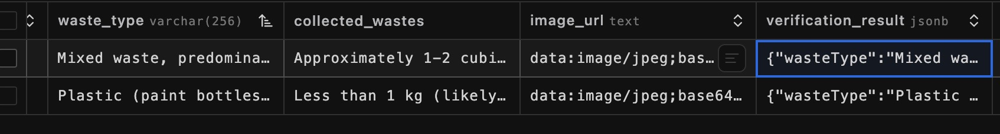<br>
        <em>Waste Type stored Neon Database</em>
    </p>
</p>

---

### 4. Waste Collection

---

#### Description

The Waste Collection feature in EcoTrack enables users to participate in community clean-up efforts by claiming and completing waste collection tasks. Users can browse a list of reported waste sites, filter by location, and select tasks to collect. Upon collecting waste, users upload a verification image, which is analyzed by Gemini AI to confirm that the collected waste matches the original report in both type and quantity. Successful verifications reward users with points, which are tracked in their transaction history and can be redeemed for rewards.

---

#### Implementation Philosophy

The waste collection system is designed to encourage community engagement, ensure accountability, and streamline the verification process:

- Users can view available collection tasks, claim them, and update their status (pending, in progress, completed, verified). This ensures that each task is clearly tracked and prevents duplication of effort.

- After collection, users upload a photo of the collected waste. Gemini AI is prompted to compare the new image with the original report, confirming both waste type and quantity. The prompt is structured to request a JSON response indicating whether the waste type and quantity match, along with a confidence score.

- The UI provides clear feedback at each step, including task status, verification progress, and reward notifications. Pagination and search functionality make it easy to find relevant tasks.

- Upon successful verification, users are automatically awarded points, which are reflected in their balance and transaction history.

---

#### Implementation Challenges

A significant challenge was ensuring that Gemini AI reliably parsed the verification prompt and returned consistent, parseable JSON responses. Despite carefully engineering the prompt to request only the required fields, we encountered an issue where, regardless of the photo provided, the AI verification consistently failed. This was likely due to either the prompt not being interpreted as intended by the AI or limitations in the model’s ability to compare before-and-after waste images. To address this, we implemented robust error handling for malformed or ambiguous responses and provided clear notifications to users when verification failed, allowing them to retry as needed. However, resolving this persistent verification failure remains an ongoing area of focus.

---

#### Diagrams

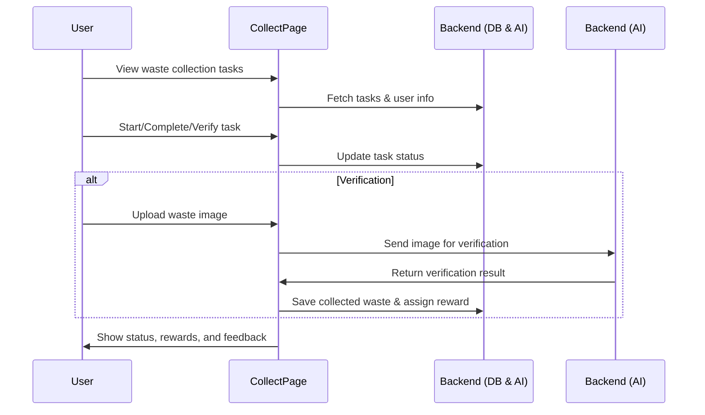
```mermaid
sequenceDiagram
    participant User
    participant CollectPage
    participant Backend (DB & AI)
    User->>CollectPage: View waste collection tasks
    CollectPage->>Backend (DB & AI): Fetch tasks & user info
    User->>CollectPage: Start/Complete/Verify task
    CollectPage->>Backend (DB & AI): Update task status
    alt Verification
        User->>CollectPage: Upload waste image
        CollectPage->>Backend (AI): Send image for verification
        Backend (AI)->>CollectPage: Return verification result
        CollectPage->>Backend (DB & AI): Save collected waste & assign reward
    end
    CollectPage->>User: Show status, rewards, and feedback
```

<p align="center">
    <p align="center">
        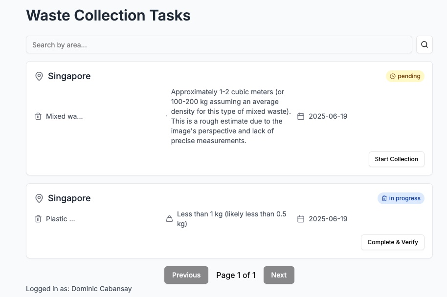<br>
        <em>Waste Collection Page</em>
    </p>
    <br>
    <p align="center">
        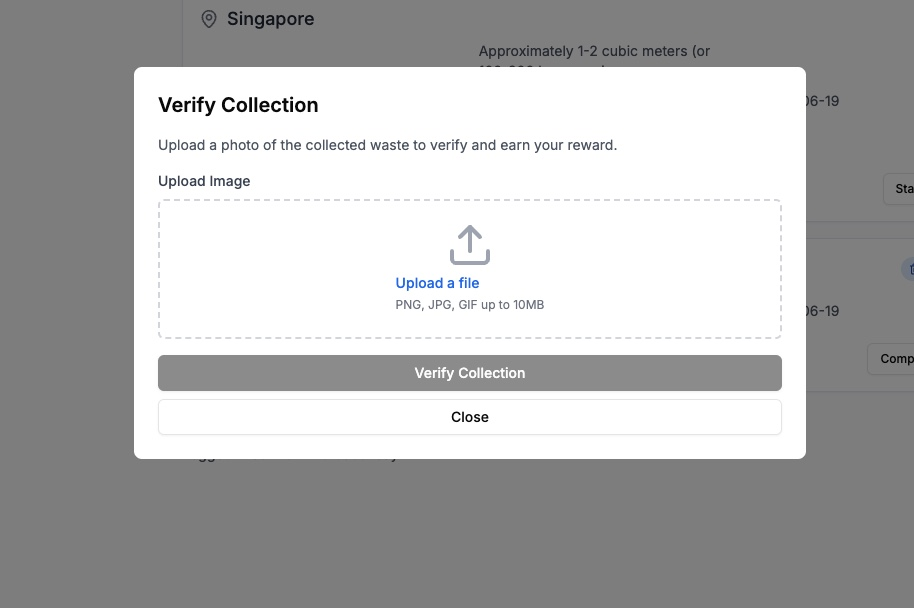<br>
        <em>Collection Verification</em>
    </p>
</p>

---

### 5. Rewards

---

#### Description

The Rewards feature in EcoTrack motivates users to engage in sustainable actions by awarding points for activities such as reporting waste or collecting litter. Users accumulate points, which are tracked as transactions and reflected in their reward balance. These points can be redeemed for various rewards, such as vouchers or eco-friendly products, which are displayed in a catalog. The Rewards page provides a clear overview of the user's current balance, recent transactions, and available rewards, making the system transparent and engaging.

---

#### Implementation Philosophy

The rewards system is designed to be transparent, fair, and user-friendly, where

- Every point-earning or redemption action is logged as a transaction, including a description, amount, and date. This ensures users can always see how their balance changes over time.

- The rewards logic is integrated with other features (e.g., reporting waste, collecting litter). When a user completes an eligible action, a transaction is automatically created and the balance is updated in real time.

- The UI clearly displays the user's balance, recent transactions, and available rewards. Redemption buttons are enabled or disabled based on the user's current balance, preventing errors and confusion.

- All reward data, transactions, and user balances are managed in the Neon database. Efficient queries and aggregation ensure fast loading and accurate calculations.

---

#### Implementation Challenges

A key challenge we are currently facing is the implementation of a robust and diverse rewards catalogue. While the current system supports point accumulation and redemption, the actual catalogue of rewards is still limited and mostly consists of placeholder items. Integrating real-world rewards—such as vouchers, eco-friendly products, or partnerships with local businesses—requires additional backend logic, third-party integrations, and administrative tools for managing inventory and fulfillment.

This is a significant area of focus for our upcoming Milestone 3, where we plan to expand the rewards catalogue, improve the redemption process, and ensure a seamless experience for both users and administrators.

---

#### Diagrams

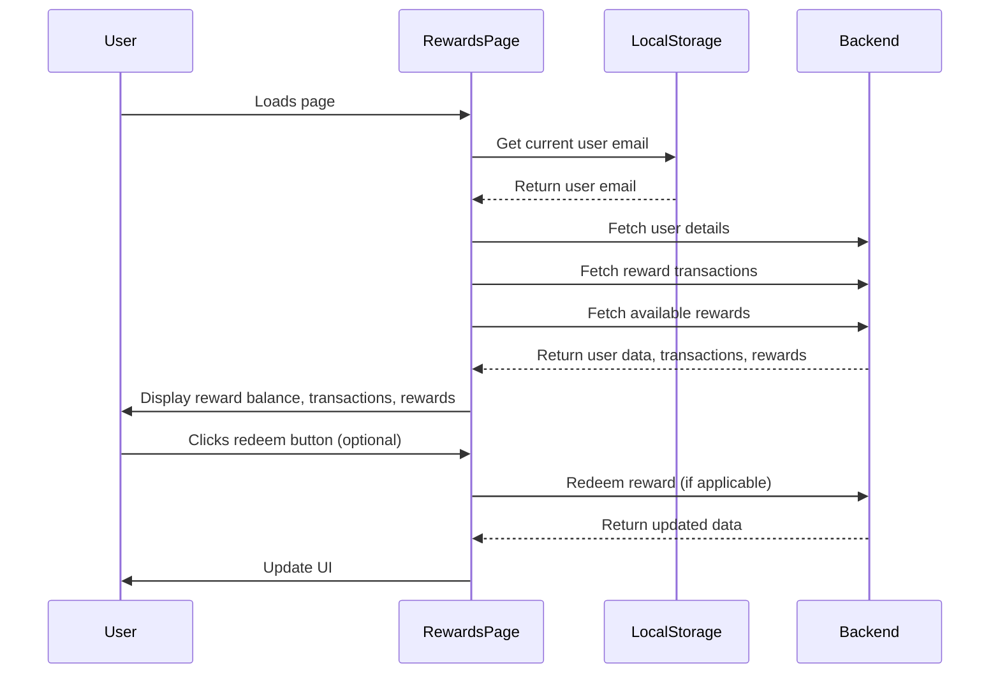
```mermaid
sequenceDiagram
    participant User
    participant RewardsPage
    participant LocalStorage
    participant Backend

    User->>RewardsPage: Loads page
    RewardsPage->>LocalStorage: Get current user email
    LocalStorage-->>RewardsPage: Return user email
    RewardsPage->>Backend: Fetch user details
    RewardsPage->>Backend: Fetch reward transactions
    RewardsPage->>Backend: Fetch available rewards
    Backend-->>RewardsPage: Return user data, transactions, rewards
    RewardsPage->>User: Display reward balance, transactions, rewards
    User->>RewardsPage: Clicks redeem button (optional)
    RewardsPage->>Backend: Redeem reward (if applicable)
    Backend-->>RewardsPage: Return updated data
    RewardsPage->>User: Update UI
```

<p align="center">
        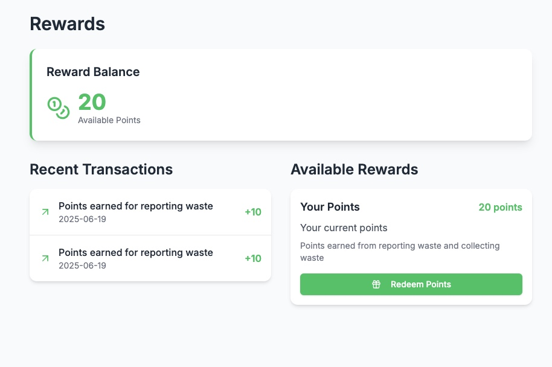<br>
        <em>Rewards page</em>
    </p>
---

### 6. Leaderboard

---

#### Description

The Leaderboard feature in EcoTrack gamifies environmental action by displaying user rankings based on their eco-friendly activities. Users can see their position relative to others, encouraging healthy competition and sustained engagement. The leaderboard shows user rankings based on total points earned.

The leaderboard is automatically updated when users earn points through waste reporting or collection activities, providing real-time feedback on their environmental impact.

---

#### Implementation Philosophy

The leaderboard system is designed to motivate continued participation while maintaining fairness. Rankings are calculated based on verified activities only, with clear point breakdowns show how rankings are determined. We also implemented achievement badges recognize different types of contributions. Overall, the UI emphasizes positive competition and community impact

The implementation focuses on performance, ensuring fast loading of rankings even with many users, and includes pagination for scalability.

---

#### Implementation Challenges

The main challenge in implementing the leaderboard was balancing performance with real-time updates. With potentially thousands of users and frequent point changes, calculating rankings efficiently required careful database optimization. We implemented caching strategies and scheduled updates to manage server load while maintaining near-real-time accuracy.

Another challenge was designing a fair scoring system that encourages consistent participation rather than one-time large contributions. This required careful tuning of point values and the introduction of time-based multipliers.

---

#### Diagrams

<p align="center">
    <p align="center">
        <br>
        <em>Leaderboard Page</em>
    </p>
</p>

---

### 7. Profile Page

---

#### Description

The Profile Page provides users with a personalized dashboard to manage their EcoTrack experience. Users can:

- View their contribution statistics and achievements
- Update their profile information and preferences
- Track their reward history and current point balance
- See their waste reporting and collection history
- View their impact metrics (e.g., total waste reported/collected)

The profile page serves as a central hub for users to monitor their environmental impact and manage their account settings.

---

#### Implementation Philosophy

The profile page is designed with user empowerment and transparency in mind:

- Clear visualization of impact metrics and achievements
- Easy access to account settings and preferences
- Integration with the rewards and notification systems

The implementation follows a modular approach, allowing for easy addition of new features and customization options as the platform grows.

---

#### Implementation Challenges

A significant challenge was organizing and presenting the diverse range of user data in a way that remains clear and manageable. We needed to balance comprehensive information display with an uncluttered user interface. This was addressed through careful UI/UX design and the use of expandable sections and tabs.

---

#### Diagrams

<p align="center">
    <p align="center">
        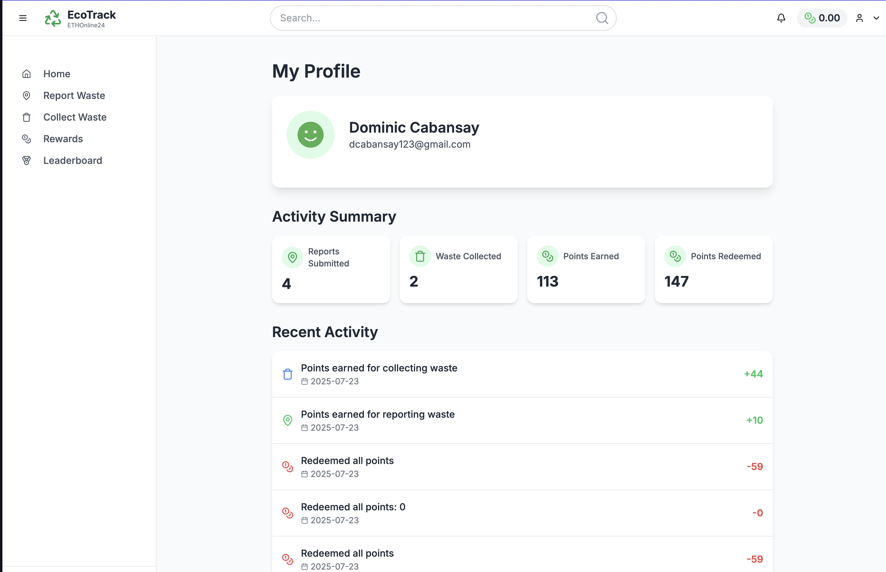<br>
        <em>Profile Page</em>
    </p>
</p>

---

## Navigation Flow

### User Journey Overview

The following diagram illustrates the main user navigation paths through EcoTrack:

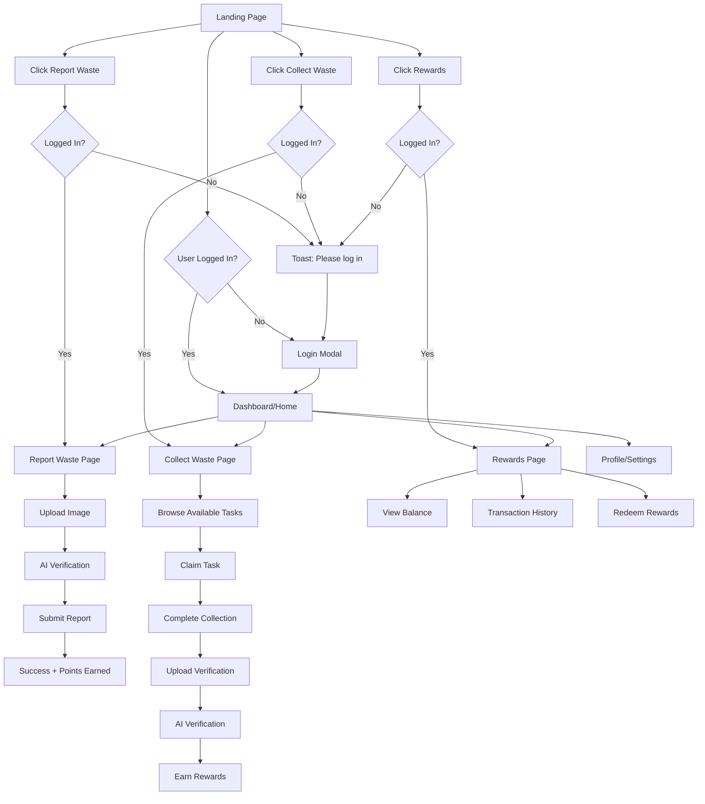
```mermaid
flowchart TD
    A[Landing Page] --> B{User Logged In?}
    B -->|No| C[Login Modal]
    B -->|Yes| D[Dashboard/Home]
    C --> D

    %% Protected route attempts from homepage
    A --> E[Click Report Waste]
    A --> F[Click Collect Waste]
    A --> G[Click Rewards]

    E --> H{Logged In?}
    F --> I{Logged In?}
    G --> J{Logged In?}

    H -->|No| K[Toast: Please log in]
    I -->|No| K
    J -->|No| K
    K --> C

    H -->|Yes| L[Report Waste Page]
    I -->|Yes| M[Collect Waste Page]
    J -->|Yes| N[Rewards Page]

    %% Authenticated user flows
    D --> L
    D --> M
    D --> N
    D --> O[Profile/Settings]

    L --> P[Upload Image]
    P --> Q[AI Verification]
    Q --> R[Submit Report]
    R --> S[Success + Points Earned]

    M --> T[Browse Available Tasks]
    T --> U[Claim Task]
    U --> V[Complete Collection]
    V --> W[Upload Verification]
    W --> X[AI Verification]
    X --> Y[Earn Rewards]

    N --> Z[View Balance]
    N --> AA[Transaction History]
    N --> BB[Redeem Rewards]
```

### Authentication Flow

The authentication process follows this sequence:

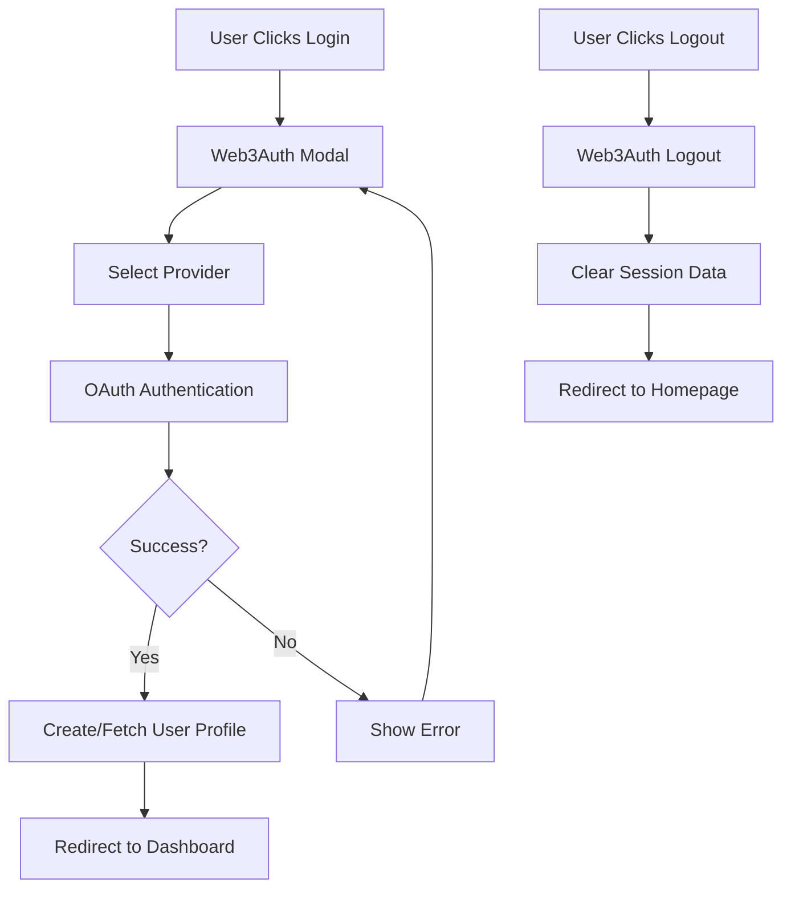
```mermaid
flowchart TD
    A[User Clicks Login] --> B[Web3Auth Modal]
    B --> C[Select Provider]
    C --> D[OAuth Authentication]
    D --> E{Success?}
    E -->|Yes| F[Create/Fetch User Profile]
    E -->|No| G[Show Error]
    F --> H[Redirect to Dashboard]
    G --> B

    I[User Clicks Logout] --> J[Web3Auth Logout]
    J --> K[Clear Session Data]
    K --> L[Redirect to Homepage]
```

### Page Navigation Structure

```
Homepage
├── Report Waste (requires login)
├── Collect Waste (requires login)
├── Rewards (requires login)
└── Login/Profile

Report Waste
├── Back to Homepage
├── AI Verification Flow
└── Success → Dashboard

Collect Waste
├── Back to Homepage
├── Task Details
├── Verification Flow
└── Success → Dashboard

Rewards
├── Back to Homepage
├── Transaction History
└── Redeem Items
```

### Route Protection

- **Protected Routes**: `/report`, `/collect`, `/rewards`
- **Unauthenticated Users**: Can only access homepage, receive login prompts for protected routes
- **Authenticated Users**: Full access to all features with persistent session
- **Redirect Behavior**: Toast notifications inform users why they need to log in
- **State Management**: User authentication state maintained via localStorage and Web3Auth

---

## Wireframe


---

## User Interface Design


---

## Unified Modelling Language (UML) Diagrams

### Sequence Diagram

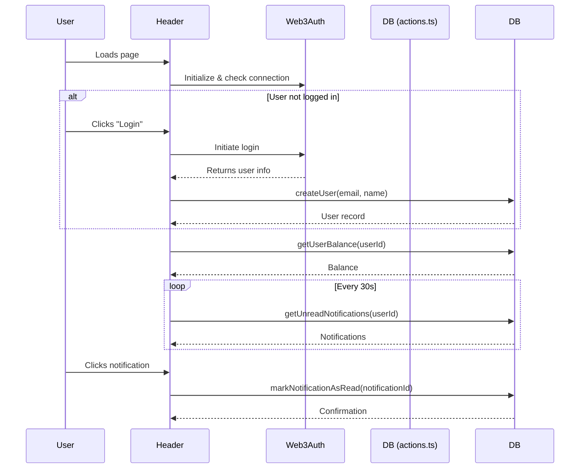
```mermaid
sequenceDiagram
    participant User
    participant Header
    participant Web3Auth
    participant DB (actions.ts)

    User->>Header: Loads page
    Header->>Web3Auth: Initialize & check connection
    alt User not logged in
        User->>Header: Clicks "Login"
        Header->>Web3Auth: Initiate login
        Web3Auth-->>Header: Returns user info
        Header->>DB: createUser(email, name)
        DB-->>Header: User record
    end
    Header->>DB: getUserBalance(userId)
    DB-->>Header: Balance
    loop Every 30s
        Header->>DB: getUnreadNotifications(userId)
        DB-->>Header: Notifications
    end
    User->>Header: Clicks notification
    Header->>DB: markNotificationAsRead(notificationId)
    DB-->>Header: Confirmation
```

### Class Diagram

The class diagram below illustrates the core structure of EcoTrack’s system design, following the Model-View-Controller (MVC) pattern within a layered architecture. At the heart of the system are the core database entities—User, Report, CollectedWaste, Reward, Notification, and Transaction—which represent the main data models (Model layer) and encapsulate both data and related business logic. The business logic services, such as DatabaseActions, Web3AuthService, VerificationService, and NotificationService, act as controllers and service layers, orchestrating interactions between the models and handling application workflows like authentication, waste verification, notification delivery, and database operations. The UI components—including Header, Button, Badge, DropdownMenu, RootLayout, and HomePage—constitute the View layer, responsible for rendering the user interface and managing user interactions. Utility classes like MediaQueryHook, DatabaseConfig, and Utils provide supporting functionality for both the UI and backend logic. Relationships between classes are clearly defined: for example, a User can submit multiple Reports, earn Rewards, receive Notifications, and have Transactions, while Reports are linked to CollectedWaste and assigned collectors. Service dependencies and UI component dependencies are also mapped, showing how controllers and views interact with models and utilities. This design enforces separation of concerns, modularity, and scalability, with each layer and component having a well-defined responsibility, thus exemplifying the MVC pattern and supporting maintainable, testable code.


```mermaid
classDiagram
    %% Core Database Entities
    class User {
        +int id
        +string email
        +string name
        +timestamp createdAt
        +createUser(email: string, name: string)
        +getUserByEmail(email: string)
        +getUserBalance(userId: int)
    }

    class Report {
        +int id
        +int userId
        +string location
        +string wasteType
        +string amount
        +string imageUrl
        +jsonb verificationResult
        +string status
        +timestamp createdAt
        +int collectorId
        +submitReport()
        +verifyReport()
        +assignCollector()
    }

    class CollectedWaste {
        +int id
        +int reportId
        +int collectorId
        +timestamp collectionDate
        +string status
        +markAsCollected()
        +updateStatus()
    }

    class Reward {
        +int id
        +int userId
        +int points
        +timestamp createdAt
        +timestamp updatedAt
        +boolean isAvailable
        +string description
        +string name
        +string collectionInfo
        +calculateReward()
        +redeemReward()
    }

    class Notification {
        +int id
        +int userId
        +string message
        +string type
        +timestamp createdAt
        +boolean isRead
        +sendNotification()
        +markAsRead()
        +getUnreadNotifications()
    }

    class Transaction {
        +int id
        +int userId
        +string type
        +int amount
        +string description
        +timestamp date
        +recordEarning()
        +recordRedemption()
        +getTransactionHistory()
    }

    %% Core Business Logic Services
    class DatabaseActions {
        +createUser(email: string, name: string)
        +getUserByEmail(email: string)
        +getUnreadNotifications(userId: int)
        +getUserBalance(userId: int)
        +getRewardTransactions(userId: int)
        +markNotificationAsRead(notificationId: int)
    }

    class Web3AuthService {
        +IProvider provider
        +Web3AuthModal web3auth
        +UserInfo userInfo
        +initializeAuth()
        +login()
        +logout()
        +getUserInfo()
        +connectWallet()
    }

    class VerificationService {
        +verifyWasteImage(imageUrl: string)
        +processImageAnalysis()
        +generateVerificationResult()
        +calculateRewardPoints()
    }

    class NotificationService {
        +sendRealtimeNotification()
        +createSystemNotification()
        +broadcastToUsers()
        +scheduleReminders()
    }

    %% UI Components
    class Header {
        +boolean sidebarOpen
        +number totalEarnings
        +UserInfo userInfo
        +Notification notifications
        +number balance
        +handleLogin()
        +handleLogout()
        +toggleNotifications()
        +updateBalance()
    }

    class Button {
        +string variant
        +string size
        +boolean asChild
        +render()
    }

    class Badge {
        +string variant
        +render()
    }

    class DropdownMenu {
        +boolean open
        +ReactNode trigger
        +ReactNode content
        +handleSelect()
    }

    %% Layout and Pages
    class RootLayout {
        +boolean sidebarOpen
        +number totalEarnings
        +handleMenuClick()
        +render()
    }

    class HomePage {
        +render()
    }

    %% Utility Classes
    class MediaQueryHook {
        +string query
        +boolean matches
        +useMediaQuery()
    }

    class DatabaseConfig {
        +NeonDatabase db
        +initializeConnection()
    }

    class Utils {
        +cn()
        +clsx()
        +twMerge()
    }

    %% Relationships
    User "1" --> "many" Report : submits
    User "1" --> "many" Reward : earns
    User "1" --> "many" Notification : receives
    User "1" --> "many" Transaction : has
    User "1" --> "many" CollectedWaste : collects

    Report "1" --> "1" CollectedWaste : collected_as
    Report "many" --> "1" User : assigned_to_collector

    Reward "many" --> "1" User : belongs_to
    Transaction "many" --> "1" User : belongs_to
    Notification "many" --> "1" User : sent_to

    %% Service Dependencies
    DatabaseActions ..> User
    DatabaseActions ..> Notification
    DatabaseActions ..> Transaction

    Web3AuthService ..> User
    VerificationService ..> Report
    NotificationService ..> Notification

    %% UI Component Dependencies
    Header ..> Web3AuthService
    Header ..> DatabaseActions
    Header ..> NotificationService
    Header ..> Button
    Header ..> Badge
    Header ..> DropdownMenu

    RootLayout ..> Header
    HomePage ..> RootLayout

    %% Utility Dependencies
    Button ..> Utils
    Badge ..> Utils
    DropdownMenu ..> Utils
    Header ..> MediaQueryHook

    DatabaseActions ..> DatabaseConfig
```

### Entity Relationship Diagram (ERD)

EcoTrack’s ERD (Entity Relationship Diagram) models a system for tracking waste reports, user activities, and rewards. The core entity is users, who can submit reports about waste, specifying details like location, type, and amount. Each report can be linked to a collector (also a user) and may result in a collected_waste record, tracking collection status and date. Users earn rewards based on their activities, with points and availability status, and all transactions (like earning or redeeming points) are logged in the transactions table. The system also sends notifications to users about relevant events, ensuring engagement and transparency throughout the waste management process.


---

## Software Engineering Practices

#### **Primary Architecture: N-tier Architecture with MVC Pattern**

For EcoTrack (an environmental tracking application), we aim to implement a **3-tier layered architecture** combined with the **Model-View-Controller (MVC)** pattern. This is because EcoTrack adopts an N-tier Architecture with the MVC Pattern to achieve a clear separation of concerns, scalability, and maintainability in its environmental tracking application. By dividing the system into three main layers—Presentation, Business Logic, and Data Access—each layer can focus on a specific responsibility: the Presentation Layer manages user interactions and UI rendering, the Business Logic Layer handles core application rules and data validation, and the Data Access Layer manages communication with databases and external APIs. Integrating the MVC pattern within this structure further organizes the code by separating data models, user interface views, and controllers that handle user input and application flow. This approach not only makes the codebase easier to test and debug but also allows teams to work on different layers independently, supports future enhancements, and ensures that changes in one layer have minimal impact on others, which is essential for a robust, evolving application like EcoTrack.

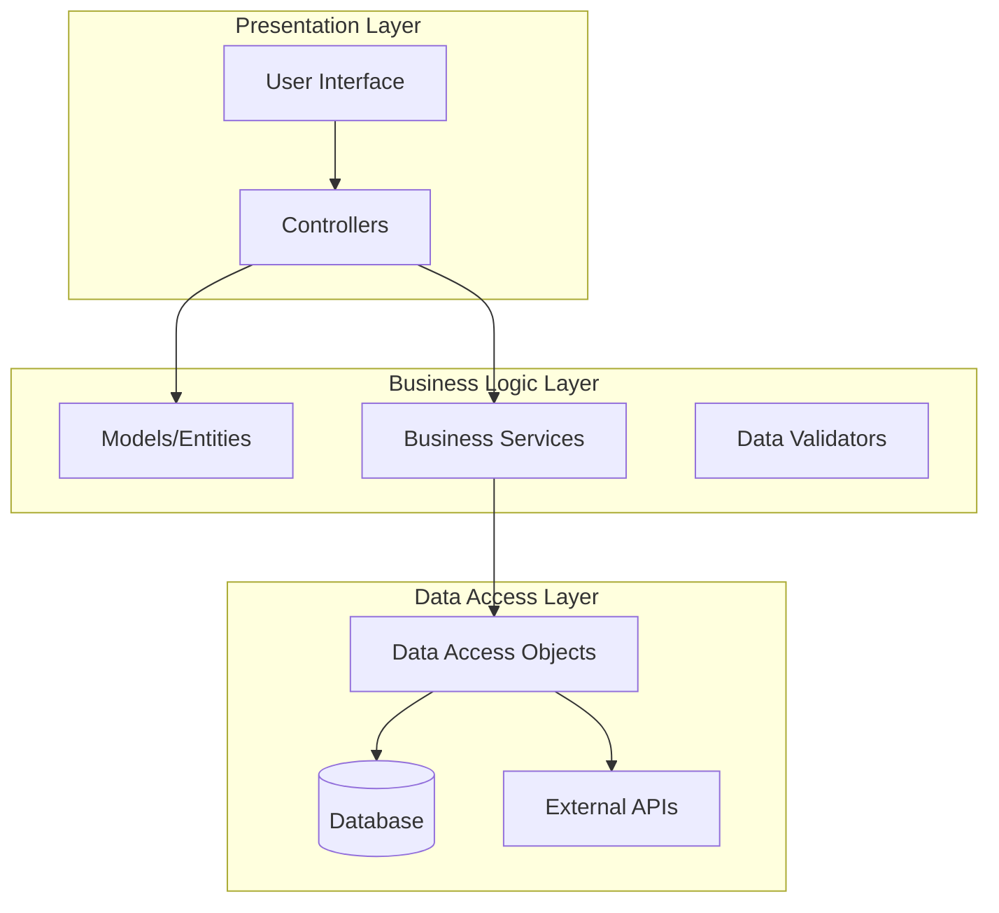
```mermaid
graph TB
  subgraph PL[Presentation Layer]
    UI[User Interface]
    Controllers[Controllers]
  end
  subgraph BL[Business Logic Layer]
    Models[Models/Entities]
    Services[Business Services]
    Validators[Data Validators]
  end
  subgraph DAL[Data Access Layer]
    DAO[Data Access Objects]
    DB[(Database)]
    APIs[External APIs]
  end
  UI --> Controllers
  Controllers --> Services
  Controllers --> Models
  Services --> DAO
  DAO --> DB
  DAO --> APIs
```

### Version Control

---

#### Branching


We use Git for version control and for facilitating the management of the code. The remote master branch will always have a working set of code at any point in time. To work on new features, we pull from the master branch and branch off to a feature branch with the feature-developer as the naming convention. Working on separate branches prevents cross-contamination of code which complicates the debugging process. Upon completion of the feature, the feature branch is committed and a pull request is performed to merge the new changes into the master branch.

---

#### Pull Requests


The pull request feature of Git is utilised when updating the remote master branch. The developer responsible for the feature creates a pull request with the partner assigned as the code reviewer. This enforces communication and prevents incorrect resolution of merge conflicts which introduces unnecessary bugs. Only after the code is reviewed, approved and merge conflicts are resolved will the pull request be successfully completed.

---

#### Issues


Git Issues were used to keep track of any open issues or existing bugs within the app. Tags were also included to help identify the type of issue be it fixes or potential enhancements. Only when the problem has been resolved will the issue be closed.

---

#### Security Measures

We use environment variables stored in a `.env` file to manage sensitive information and configuration secrets securely. This includes API keys, database connection strings, authentication secrets, and other credentials required by the application. By keeping these values in `.env` and out of the codebase, we prevent accidental exposure of secrets in version control (e.g., GitHub). The `.env` file is included in `.gitignore` to ensure it is never committed to the repository.

This approach helps protect user data, prevents unauthorized access, and supports secure deployment across different environments.

---

## Quality Control

As part of delivering a minimum viable product, we also wish to ensure that EcoTrack works as intended,
ensuring that users are able to use EcoTrack without being faced with countless bugs. As such, we employ
the use of several levels of testing as listed below.

### System Testing

System testing is essential to test features and fix bugs to ensure EcoTrack performs as
expected. For EcoTrack, we used two main categories of automated testing:

1. Unit Testing
2. Integration Testing

#### Unit Testing

The purpose of unit testing is to ensure that small units of code work, such that when bugs arise, we
know that it is not due to the functions that were already implemented. With such tests, this allows
us to narrow down what to look for when bugs arises, allowing us to fix errors swiftly.

For our React frontend, we tested our UI components and utility functions using tools using jest.

<!-- Show screenshots for unit testing -->
<p align="center">
        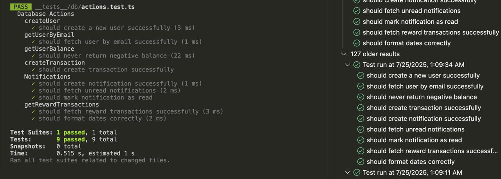<br>
        <em>Unit Test Results</em>
    </p>

| Test ID | User Story                                                                                    | Testing Objective                                                    | Steps Taken                                                                                                                                       | Expected Results                                                                        | Pass/Fail | Date Tested |
| ------- | --------------------------------------------------------------------------------------------- | -------------------------------------------------------------------- | ------------------------------------------------------------------------------------------------------------------------------------------------- | --------------------------------------------------------------------------------------- | --------- | ----------- |
| 1       | As a new user, I want to create an account so that I can access the reward system             | Verify that createUser function successfully creates a new user      | 1. Mock database insert operation<br>2. Call createUser with email and name<br>3. Verify returned user object                                     | User object returned with id: 1, email: 'test@example.com', name: 'Test User'           | Pass      | 2025-07-25  |
| 2       | As a system, I need to retrieve user information by email for authentication                  | Verify that getUserByEmail function fetches user data correctly      | 1. Mock database select operation<br>2. Call getUserByEmail with test email<br>3. Verify returned user data                                       | User object returned with correct email and user details                                | Pass      | 2025-07-25  |
| 3       | As a user, I want to see my current balance so that I know how many points I have             | Verify that getUserBalance never returns negative values             | 1. Mock transactions with net negative balance (earned: 10, redeemed: 20)<br>2. Call getUserBalance function<br>3. Verify balance is not negative | Balance returns 0 instead of -10 when calculations would result in negative             | Pass      | 2025-07-25  |
| 4       | As a user, I want to earn points for reporting so that I can be rewarded for my contributions | Verify that createTransaction function creates reward transactions   | 1. Mock database insert operation<br>2. Call createTransaction with 'earned_report' type<br>3. Verify transaction creation                        | Transaction created successfully with correct type and amount                           | Pass      | 2025-07-25  |
| 5       | As a user, I want to receive notifications so that I stay informed about my account activity  | Verify that createNotification function works correctly              | 1. Mock database insert operation<br>2. Call createNotification with test message<br>3. Verify notification creation                              | Notification created successfully with correct message and type                         | Pass      | 2025-07-25  |
| 6       | As a user, I want to see my unread notifications so that I don't miss important updates       | Verify that getUnreadNotifications retrieves unread notifications    | 1. Mock database select operation<br>2. Call getUnreadNotifications for test user<br>3. Verify array is returned                                  | Array of unread notifications returned successfully                                     | Pass      | 2025-07-25  |
| 7       | As a user, I want to mark notifications as read so that I can manage my notification list     | Verify that markNotificationAsRead updates notification status       | 1. Mock database update operation<br>2. Call markNotificationAsRead with notification ID<br>3. Verify update operation called                     | Database update operation executed successfully                                         | Pass      | 2025-07-25  |
| 8       | As a user, I want to view my reward transaction history so that I can track my earnings       | Verify that getRewardTransactions fetches transaction history        | 1. Mock database select with sample transactions<br>2. Call getRewardTransactions for test user<br>3. Verify transaction array structure          | Array returned with transactions containing type, amount, and other required properties | Pass      | 2025-07-25  |
| 9       | As a system, I need to format dates consistently so that transaction dates are readable       | Verify that getRewardTransactions formats dates in YYYY-MM-DD format | 1. Mock transactions with Date objects<br>2. Call getRewardTransactions function<br>3. Check date format in returned data                         | Transaction dates formatted as YYYY-MM-DD strings                                       | Pass      | 2025-07-25  |

#### Integration Testing

Integration testing is used to simulate and mimic user interactions with the app such as scrolling, selecting, entering certain texts and clicking on buttons.

| Test ID | User Story                                                                                                   | Testing Objective                                                           | Steps Taken                                                                                                                                                                                           | Expected Results                                                                                        | Pass/Fail | Date Tested |
| ------- | ------------------------------------------------------------------------------------------------------------ | --------------------------------------------------------------------------- | ----------------------------------------------------------------------------------------------------------------------------------------------------------------------------------------------------- | ------------------------------------------------------------------------------------------------------- | --------- | ----------- |
| 1       | As a new user, I want to log in or create an account using Web3Auth so I can access EcoTrack features.       | Test the ability to authenticate and onboard a new user.                    | 1. Launch the app<br>2. Click "Login"<br>3. Select a provider (e.g., Google)<br>4. Complete OAuth flow<br>5. App fetches/creates user profile<br>6. User is redirected to dashboard                   | User is authenticated, profile is created if new, and dashboard is shown                                | Pass      | 18/07/2024  |
| 2       | As a user, I want to report waste by uploading an image and location so authorities can be notified.         | Test the waste reporting flow with image and location input.                | 1. Log in<br>2. Navigate to "Report Waste"<br>3. Upload a waste image<br>4. Enter/select location<br>5. (Optional) Add description<br>6. Click "Submit"<br>7. Confirm submission                      | Waste report is created, confirmation is shown, and user may receive points                             | Pass      | 19/07/2024  |
| 3       | As a user, I want the app to verify my waste report using AI so I can get accurate feedback and rewards.     | Test AI verification of waste type and quantity from uploaded image.        | 1. Log in<br>2. Go to "Report Waste"<br>3. Upload image<br>4. Click "Verify Waste"<br>5. Wait for AI response<br>6. Review AI results<br>7. Submit report                                             | AI returns waste type, quantity, and confidence; user can submit only if valid                          | Pass      | 20/07/2024  |
| 4       | As a user, I want to view and claim waste collection tasks so I can participate in clean-up efforts.         | Test browsing, claiming, and updating status of collection tasks.           | 1. Log in<br>2. Go to "Collect Waste"<br>3. Browse available tasks<br>4. Claim a task<br>5. Mark as in progress/completed                                                                             | Task status updates, user is assigned as collector, and progress is tracked                             | Pass      | 21/07/2024  |
| 5       | As a user, I want to upload a verification image after collecting waste so I can earn rewards.               | Test post-collection verification and reward assignment.                    | 1. Log in<br>2. Claim a collection task<br>3. Upload verification image<br>4. Click "Verify Collection"<br>5. Wait for AI to compare images<br>6. Receive result and points                           | AI confirms collection, user is awarded points, and status is updated                                   | Pass      | 22/07/2024  |
| 6       | As a user, I want to view my rewards balance and transaction history so I can track my eco-friendly actions. | Test rewards page for balance, transactions, and redemption.                | 1. Log in<br>2. Go to "Rewards"<br>3. View balance and transactions<br>4. Attempt to redeem a reward (if eligible)                                                                                    | Balance and transactions are shown; redemption works if points are sufficient                           | Pass      | 23/07/2024  |
| 7       | As a user, I want to view the leaderboard so I can see how my eco-friendly actions compare to others.        | Test the leaderboard feature for displaying user rankings and achievements. | 1. Log in<br>2. Navigate to "Leaderboard" page<br>3. Observe the list of top users and their points<br>4. Check your own ranking and achievements<br>5. Confirm leaderboard updates after new actions | Leaderboard displays accurate rankings, user's position is visible, and updates reflect recent activity | Pass      | 24/07/2024  |

<!-- Show screenshots for integrated testing -->

### User Testing

Apart from automated testing, user testing was conducted with personnels whose criteria meets the target audience. User testing is the process of having end users test and evaluate the product or feature.

Below are the summarised results that we have obtained through conducting user testing with 10 users.

<!-- Insert Table When Completed -->
<p align="center">
        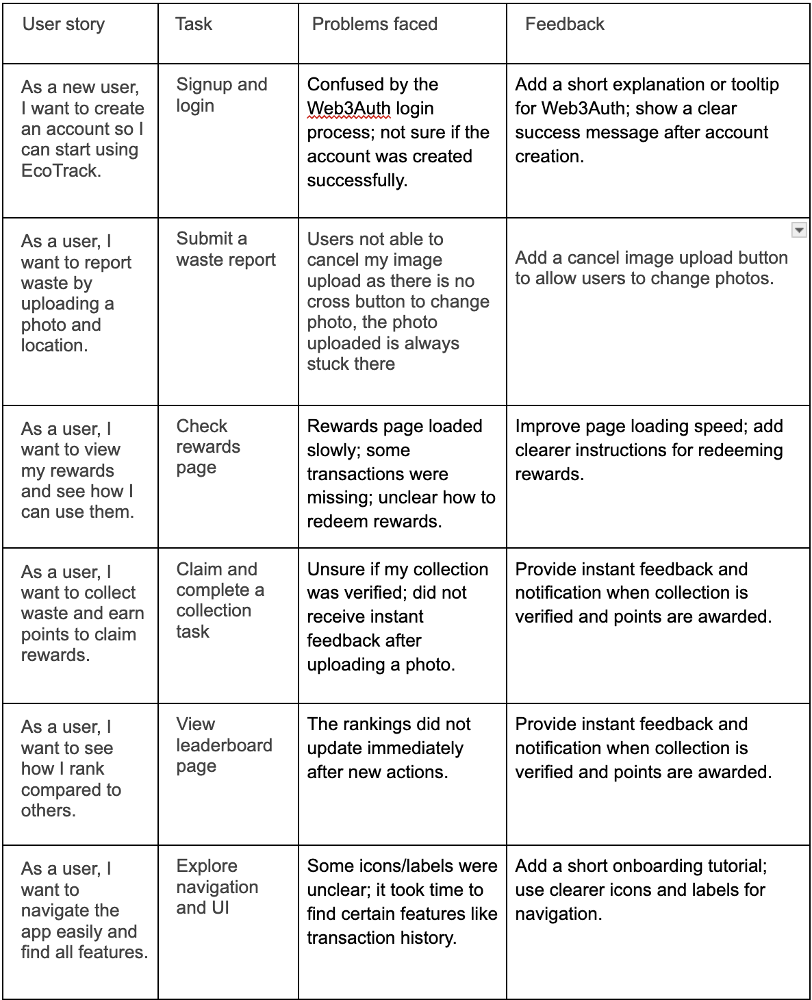<br>
    </p>

Summary of Post-Interview Questions
| Question | Sample Answer |
|------------------------------------------------------------------------------------------------------------|-------------------------------------------------------------------------------------------------------------------------------------------------------------------------------------------------------------------------------|
| On a scale of 1 - 10, how likely are you to use this app? Why? | 8 – I care about sustainability and the app makes it easy to report waste. The rewards and leaderboard features motivate me to participate. |
| On a scale of 1 - 10, what is your overall experience with the app? Why? | 7 – The app is visually appealing and the main features work, but there are a few bugs and some features could be more polished. |
| What are some things that can be improved on? | Faster image upload, more user-friendly location input, more variety in rewards, and faster loading times on some pages. |
| On a scale of 1 - 10, how difficult was it to navigate the app and how intuitive was the UI? Why? | 7 – Navigation was mostly straightforward, but some features were hard to find. Clearer icons/labels and an onboarding tutorial would help. |
| What are some parts of the app you disliked? | The Web3Auth login was confusing, lack of instant feedback after submitting a report, and some pages (like rewards) felt incomplete.|
| Additional Comments | Overall, EcoTrack is promising and useful, but a few usability improvements and more complete features would make it even better. |

---

## Coding Standard

This coding standard outlines the conventions and best practices followed throughout the EcoTrack codebase to ensure code quality, maintainability, and consistency across all contributors.

---

### 1. **General Principles**

- **Readability First:** Code should be easy to read and understand. Prioritize clarity over cleverness.
- **Consistency:** Follow established patterns and conventions throughout the codebase.
- **Simplicity:** Write simple, modular, and reusable code. Avoid unnecessary complexity.
- **Documentation:** Use comments and docstrings where necessary to explain non-obvious logic.

---

### 2. **File and Folder Structure**

- **Feature-based Organization:** Group files by feature/domain (e.g., `api/`, `components/`, `utils/`).
- **Naming:** Use lowercase and hyphens for folders (e.g., `user-profile/`), and PascalCase for React components (e.g., `UserProfile.tsx`).
- **Entry Points:** Use `index.ts` or `index.tsx` for module entry points when appropriate.

---

### 3. **Naming Conventions**

- **Variables & Functions:** Use `camelCase` (e.g., `getUserByEmail`, `userId`).
- **Classes & Components:** Use `PascalCase` (e.g., `UserCard`, `ReportForm`).
- **Constants:** Use `UPPER_SNAKE_CASE` for global constants (e.g., `MAX_REWARD_POINTS`).
- **Files:** Use `kebab-case` for file names (e.g., `user-profile.tsx`).

---

### 4. **TypeScript Usage**

- **Type Safety:** All code must be written in TypeScript. Use explicit types and interfaces for function parameters, return values, and objects.
- **Type Inference:** Leverage TypeScript’s type inference where appropriate, but prefer explicit types for public APIs and exported functions.
- **Interfaces vs Types:** Use `interface` for object shapes and `type` for unions or more complex types.

---

### 5. **React & Next.js**

- **Functional Components:** Use functional components with hooks. Avoid class components.
- **Props Typing:** Define prop types using TypeScript interfaces.
- **Hooks:** Use React hooks (`useState`, `useEffect`, etc.) for state and lifecycle management.
- **File Extensions:** Use `.tsx` for files containing JSX/TSX, `.ts` for logic-only files.
- **Pages & API Routes:** Follow Next.js conventions for file placement in `app/` and `pages/` directories.

---

### 6. **Styling**

- **Tailwind CSS:** Use Tailwind utility classes for styling. Avoid inline styles unless necessary.
- **Component Libraries:** Use `shadcn/ui` and `@radix-ui` components for consistent UI patterns.
- **Class Management:** Use `clsx` or `tailwind-merge` for conditional class names.

---

### 7. **API & Database**

- **API Routes:** Use RESTful conventions for API endpoints. Place API logic in `app/api/`.
- **Database Access:** Use Drizzle ORM for all database operations. Keep queries in `utils/db/actions.ts` or feature-specific files.
- **Error Handling:** Always handle errors gracefully and return meaningful error messages and status codes.

### 8. **Code Formatting & Linting**

- **Formatter:** Use Prettier for automatic code formatting.
- **Linter:** Use ESLint with the Next.js and TypeScript recommended rules.
- **Indentation:** Use 2 spaces for indentation.
- **Line Length:** Limit lines to 100 characters where possible.
- **Trailing Commas:** Use trailing commas in multi-line objects and arrays.

By adhering to this coding standard, we ensure that EcoTrack remains robust, maintainable, and accessible for all current and future contributors.

---

## Timeline and Development Plan

### **Milestone 1 - Technical Proof of Concept**

- **Authentication System**: Web3Auth integration with wallet-based login
- **Frontend Foundation**: Next.js 15 with TypeScript and Tailwind CSS
- **Database Layer**: PostgreSQL with Drizzle ORM, normalized schema
- **Core UI Components**: Responsive design with shadcn/ui components
- **Image Upload**: Integrated waste reporting with photo capture

### **Milestone 2 - Core Prototype**

- **AI Verification**: Smart waste classification and validation system
- **Rewards Engine**: Point-based incentive system with balance tracking
- **Notification System**: Real-time updates for user actions and rewards
- **Data Management**: Comprehensive reporting and tracking features
- **User Experience**: Polished interface with loading states and error handling

### **Milestone 3 - Extended System**

- **Gamification**: Leaderboard system with user rankings and achievements
- **Settings/Profile Page**: Settings/Profile page for user preferences
- **Optimization**: Performance improvements and user feedback integration
- **Testing & Refinement**: Bug fixes, UX enhancements, and system stability

<p align="center">
    <p align="center">
        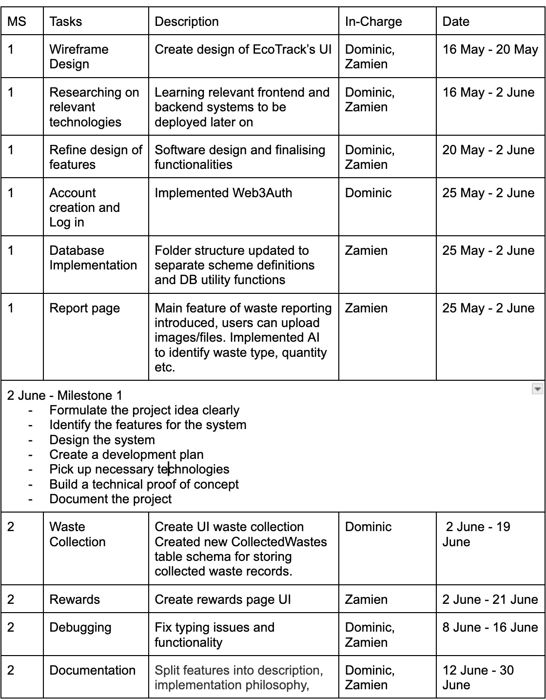<br>
    </p>
    <br>
    <p align="center">
        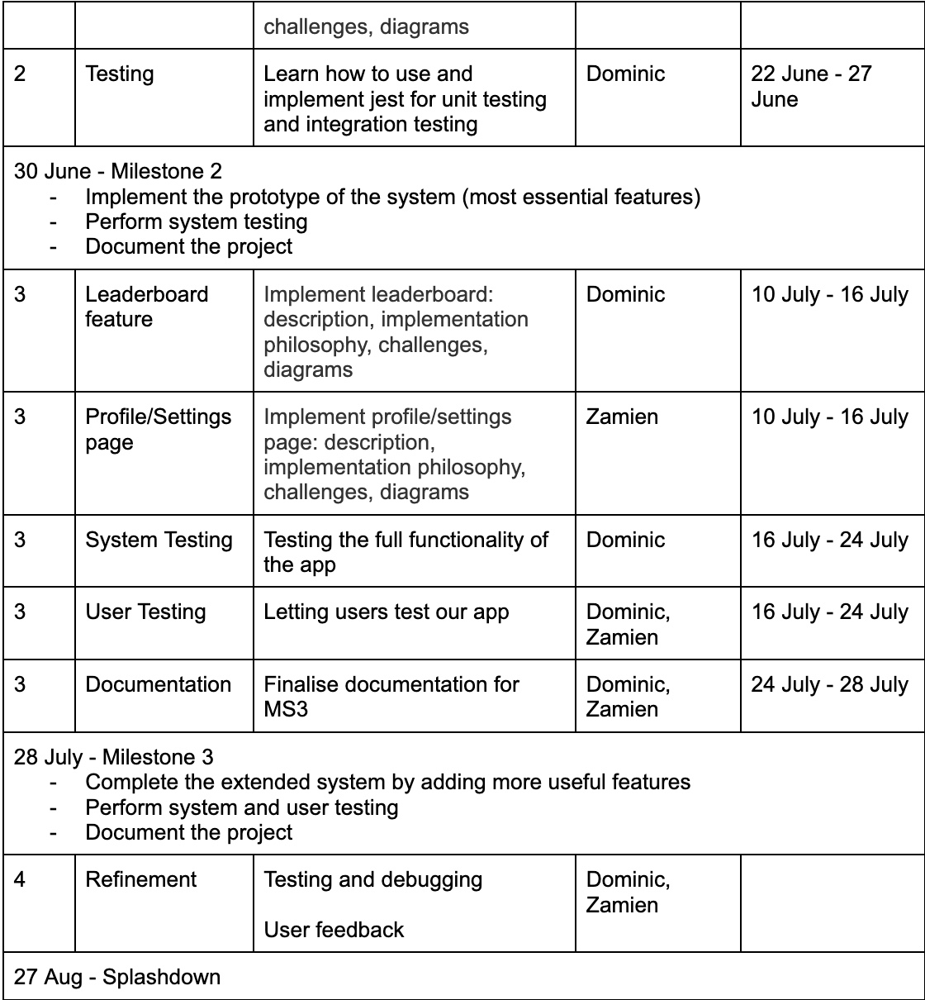<br>
    </p>
</p>

## Deployment

This app was deployed via Vercel. [View the live site here](https://eco-track-dominics-projects-f0dc4341.vercel.app).

## Tech Stack

The EcoTrack project leverages a modern, full-stack technology stack to deliver a robust, scalable, and user-friendly experience:

Tech Stack:

Frontend:

- Next.js 15 (React framework)
- TypeScript
- Tailwind CSS

Authentication:

- Web3Auth

Backend:

- Next.js API Routes
- Node.js

Database:

- PostgreSQL
- Drizzle ORM
- Neon (Postgres hosting)

AI & Image Processing:

- Google Gemini Generative AI

Testing & Quality:

- Jest
- ESLint
- Prettier

Other Tools:

- Git
- GitHub

## Proof-of-Concept Video (Prototype)

<!-- Insert Google drive link -->

https://drive.google.com/drive/folders/1T468USXM_TYiXcf9otRLfU0ZamnioWds?usp=sharing

## Project Logging

https://docs.google.com/spreadsheets/d/1qt2mJ2I-7t5aVOVSAWLBEEHEN_XpdWWZP9iVdjLWB6Y/edit?gid=0#gid=0
