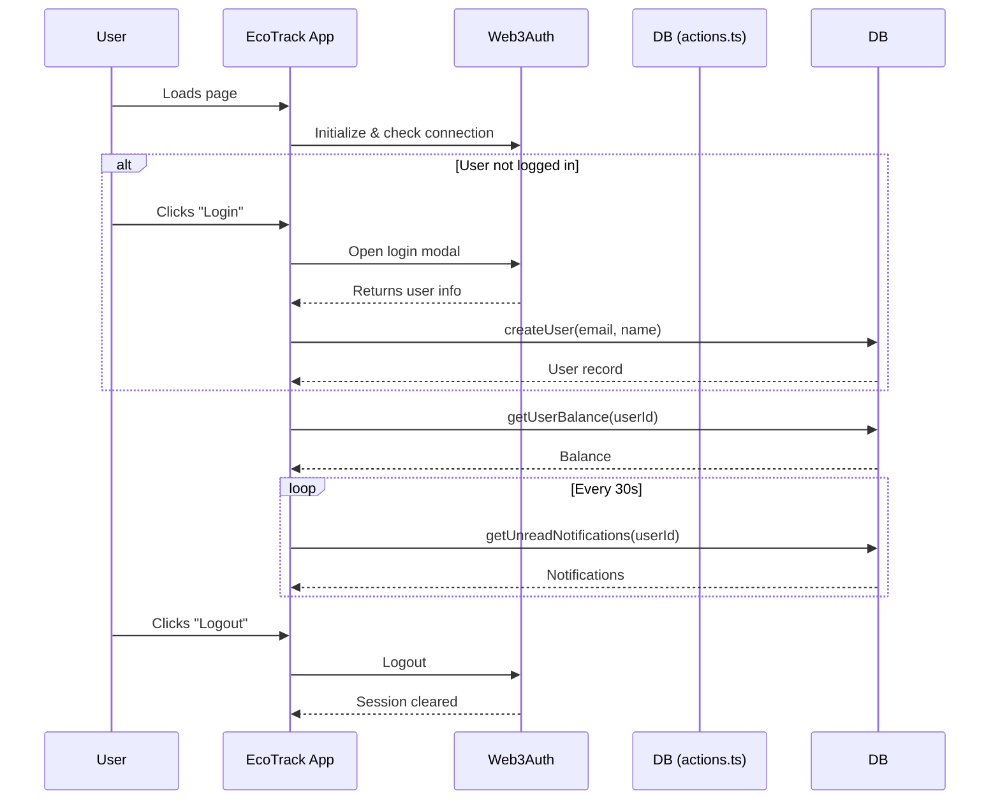
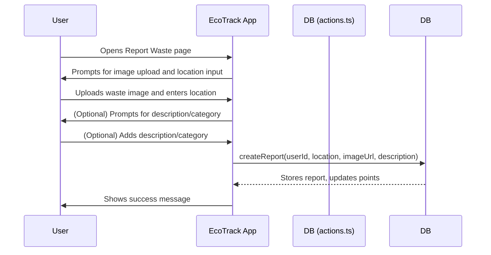
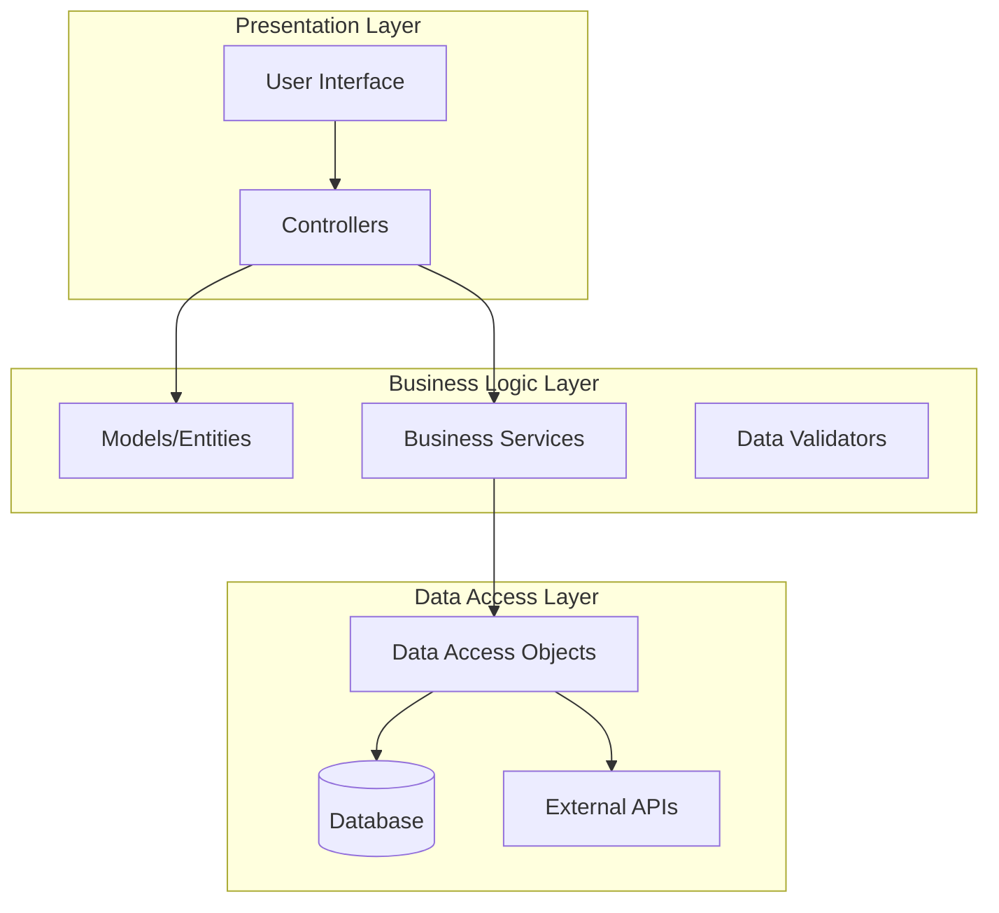
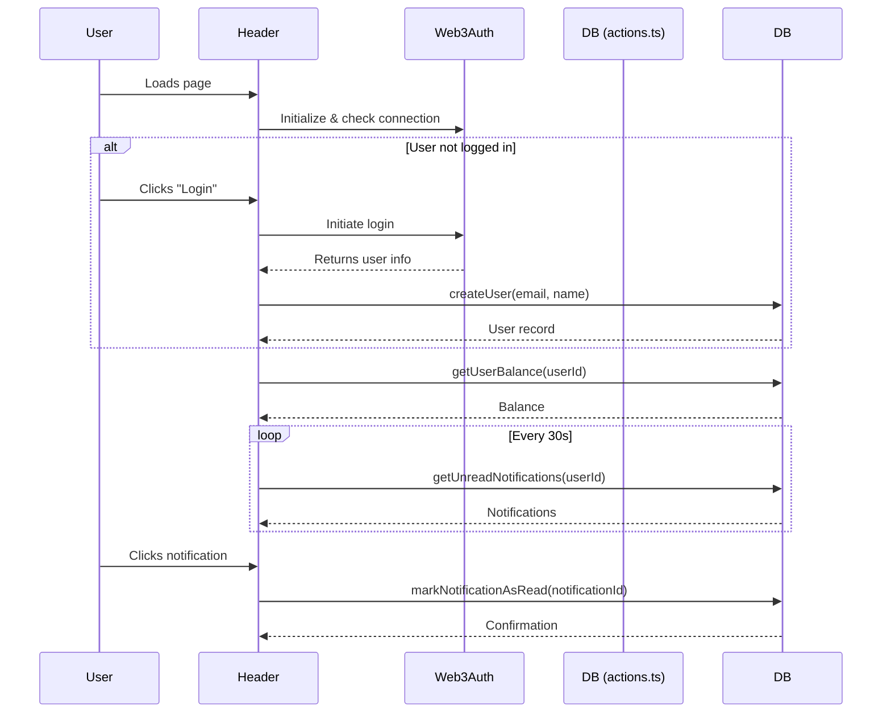
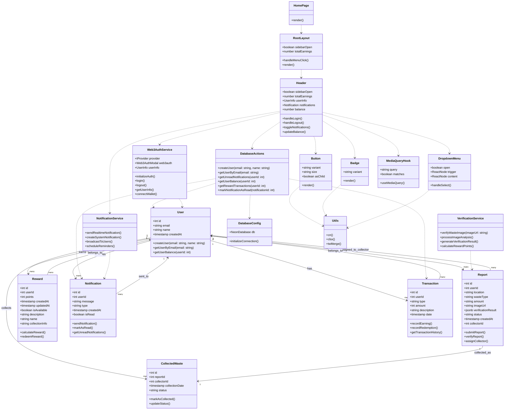

# EcoTrack (NUS Orbital Project)

EcoTrack, an AI-powered waste management platform.

Proposed level of achievement: Apollo 11

## Promotional Posters

<!-- Liftoff -->


<!-- Milestone 1 -->

<!-- Milestone 2 -->

<!-- Milestone 3 -->

## Proof-of-Concept :

https://github.com/user-attachments/assets/7405a2f0-2817-4729-8379-8a0e70848eff

## Before using the app

### Limitations

🔍 1. AI Accuracy & Dependence
• Limitation: Reliance on Google Gemini AI for waste classification may lead to incorrect or biased predictions, especially for unclear images.
• Impact: Users may get inaccurate rewards or feedback, reducing trust in the system.

⚖️ 2. Verification Bottleneck
• Limitation: Waste report verifications may require human validation in some cases, especially for edge scenarios.
• Impact: Slows down the reward system and notification flow, reducing real-time effectiveness.

🔒 3. Web3Auth Adoption Barrier
• Limitation: Not all users (especially older or less tech-savvy ones) are comfortable with Web3 wallet-based authentication.
• Impact: Limits app accessibility and onboarding rate among the general population.

## Milestone 2 (Prototyping)

### Motivation

Singapore faces growing challenges in waste management due to rising urbanization and consumption.
Common issues include:

<ul>
<li>Low Recycling Rates: Many residents are unsure about proper recycling practices, leading to contamination and reduced recycling efficiency.
</li>
<li>Inefficient Collection: Waste bins often overflow or are collected when not full, resulting in resource wastage.
</li>
<li>
Lack of Engagement: Residents have limited visibility into their waste habits and few incentives to improve them.
</li>
</ul>
EcoTrack, an AI-powered waste management platform aims to address these pain points by empowering both residents and municipal authorities with real-time data, actionable insights, and user-friendly tools to promote responsible waste disposal and recycling. It is designed to incentivize and streamline waste reporting and collection. Our goal is to create a community-driven approach to waste management, rewarding users for their eco-friendly actions.

### Aim

We aim to allow residents to track their waste disposal and recycling habits, provide timely reminders and educational content to encourage correct recycling. At the same time, we also aim to enable authorities to monitor bin fill levels and optimize collection routes and engage users through gamification and community leaderboards to foster sustainable habits. EcoTrack will empower Singapore’s residents and authorities to collaboratively improve waste management practices. By combining education, data-driven insights, and gamification, our app aims to make sustainability a daily habit for all.

### User Stories

As a resident who wants to contribute to a cleaner neighborhood, I want to easily report overflowing or illegal waste via the app, so that authorities can respond quickly and efficiently.

As a resident who recycles regularly, I want to track my recycling habits and see my progress, so I can stay motivated and improve my environmental impact.

As a busy user, I want to receive timely notifications about waste collection schedules and recycling drives, so I never miss important dates or opportunities to participate.

As a waste collector, I want to view optimized collection routes and real-time bin fill levels, so I can make my rounds more efficiently and avoid unnecessary trips.

As a municipal officer, I want to access analytics and reports on waste generation and recycling rates, so I can make informed decisions about resource allocation and public outreach.

As a community leader, I want to organize local clean-up events and track participation through the app, so I can foster greater community involvement.

As a user with limited technical skills, I want the app to have an intuitive interface and clear instructions, so I can be incentivised to use the app.

As a resident who sometimes forgets to sort waste properly, I want the app to provide educational content and AI-powered waste classification, so I can learn and improve my
sorting habits.

## Features

### 1. User Acount Authentication [Completed]

---

#### Description

As EcoTrack is a personalized waste management and rewards platform, each user must be authenticated with a unique account.
EcoTrack implements a Web3 wallet-based authentication system using Web3Auth, allowing users to:

- Log in using a Web3 wallet (e.g., Google, Facebook, or other OAuth providers via Web3Auth)

- Create an account automatically on first login (no manual registration required)

- Securely store user identity and session using cryptographic signatures

- Log out and clear session data

Upon successful authentication, the user's information (email, name, wallet address) is retrieved and stored in the database if not already present. All authentication and user management logic is handled via the Web3Auth SDK and backend API calls.

---

#### Implementation Philosophy

Implementation Philosophy
EcoTrack’s authentication flow is designed for seamless onboarding and security:

- On app load, the authentication controller checks if the user is already logged in via Web3Auth.

- If the user is authenticated, their profile is fetched (or created if new) and stored in the app state.

- If not authenticated, the user is prompted to log in via Web3Auth’s modal, supporting multiple OAuth providers and wallets.

- After login, the app ensures a user profile exists in the database (creating one if needed).

- The user is then routed to the main dashboard.

- All authentication errors (e.g., network mismatch, failed login) are caught and displayed to the user via toast notifications.

- The authentication state is monitored, and users are redirected to login if their session expires.

- This approach ensures that every user has a unique, secure account, and onboarding is as frictionless as possible, leveraging modern Web3 standards.

---

#### Implementation Challenges

For user authentication, the key issue we faced was network mismatch and configuration. Enusring the Web3Auth client ID and network configuartion match the project's setting was quite difficult and we kept facing usses where the wallet was not being initialised, leading to failed logins. Additionally, handling session persistence and automatic re-authentication required careful integration with Web3Auth's SDK and local storage.

---

#### Diagrams



<p align="center">
    <p align="center">
        <br>
        <em>Login Modal</em>
    </p>
    <br>
    <p align="center">
        <br>
        <em>Sign Out</em>
    </p>
</p>

---

### 2. Waste Reporting and Image Upload

---

#### Description

EcoTrack allows users to report waste incidents by uploading images and specifying where the waste was found. The reporting process is designed to be straightforward:

- Users can upload a photo of the waste (from their device or by taking a new photo).
- Users provide the location where the waste was found, either by entering an address.
- Each report includes the image, location, and the waste type (after AI verification), and is stored in the database with a status (e.g., pending, collected).
- Upon successful submission, users receive confirmation and may be awarded points as part of the rewards system.

All image uploads and report submissions are handled via the Next.js frontend, with backend logic in `/utils/db/actions.ts` and API routes for database integration.

---

#### Implementation Philosophy

The waste reporting and image upload feature is designed for simplicity and accessibility:

- Users only need to provide an image and location, lowering the barrier to reporting.
- The UI guides users through uploading an image and specifying the location in a few easy steps.
- All reports are validated before submission, ensuring required fields (image, location) are present.
- Users receive immediate feedback on the status of their report submission via toast notifications.
- The reporting logic is integrated with the rewards and notification systems, so users are incentivized and kept informed.

The frontend checks for user authentication before allowing report submission. If the user is not logged in, they are prompted to authenticate first. The backend ensures that each report is associated with a valid user and that all required data is stored securely.

---

#### Implementation Challenges

As this section was one of the first features implemented in EcoTrack, we encountered a variety of setbacks and technical challenges throughout the development process.

The first major challenge was designing a suitable data structure for storing waste reports and handling image uploads. Since EcoTrack uses Neon as its database, we needed to ensure that each report could efficiently reference its associated image, user, and location data. As we did not use any cloud storage service, images were stored directly as base64-encoded strings within the database itself. This approach simplified the architecture but required careful consideration of database performance and storage limits.

Another significant issue was handling the asynchronous nature of image uploads and database writes. There were cases where the image upload would succeed but the database write would fail (or vice versa), leading to orphaned images or incomplete reports. To address this, we implemented atomic operations and transaction-like logic in our backend API. Only after a successful image upload would the report be created in the database, and any failures would trigger cleanup routines to remove unused images.

Managing location data also presented challenges. Some users denied location permissions, while others entered ambiguous or incomplete addresses. To overcome this, we provided multiple options for location input: users could use GPS or manually enter an address.

State management on the frontend was another hurdle, especially when users navigated away from the reporting page or experienced network interruptions. We initially faced issues where partially completed reports would be lost, or duplicate submissions would occur if users retried after a failure. To solve this, we implemented temporary local state caching and ensured that all required fields were validated before allowing submission.

Finally, authentication and access control required careful handling. We needed to ensure that only authenticated users could submit reports, but also wanted to maintain a smooth user experience. Our solution was to check authentication status before allowing access to the reporting page, and to redirect unauthenticated users to the login flow, preserving their progress so they could resume reporting after logging in.

---

#### Diagrams



<p align="center">
    <p align="center">
        <br>
        <em>Report Waste Page</em>
    </p>
    <br>
    <p align="center">
        <br>
        <em>Image Upload</em>
    </p>
        <p align="center">
        <br>
        <em>Location Input</em>
    </p>
</p>

---

### 3. AI Verification of Waste Type

---

#### Description

EcoTrack leverages Google Gemini AI to automatically verify the type and estimated amount of waste from user-uploaded images. This feature streamlines the reporting process, reduces manual input, and improves data accuracy by providing AI-generated waste classifications and quantity estimates.

- Users upload a photo of the waste.
- Upon clicking "Verify Waste," the image is sent to Gemini AI for analysis.
- Gemini AI returns a JSON object containing the predicted waste type (e.g., plastic, paper), estimated quantity (e.g., 2kg, 5 litres), and a confidence score.
- The results are displayed to the user for review before final submission.
- The verified data is then included in the waste report stored in the database.

---

#### Implementation Philosophy

The AI verification feature is designed to minimize user effort and maximize data reliability:

- **Prompt Engineering:**  
  The prompt sent to Gemini AI is crafted to elicit structured, actionable responses. It instructs the AI to act as a waste management expert and to analyze the image for three key outputs: waste type, approximate quantity, and confidence level. The prompt explicitly requests a JSON response in the following format:
  ```json
  {
    "wasteType": "type of waste",
    "quantity": "approximate quantity",
    "confidence": confidence level (0-100)
  }
  ```

This ensures the AI’s output is easily parsed and directly usable in the app.

- The uploaded image is converted to a base64 string and sent as inline data to Gemini AI, ensuring compatibility and security.

- The verification process is triggered by a single button click. Users receive real-time feedback on the verification status (verifying, success, or failure) and can review the AI’s results before submitting their report.

- Only verified results (with all required fields present) are accepted for submission. If the AI response is malformed or missing data, the user is prompted to retry.

- The AI verification is tightly integrated with the reporting workflow, ensuring that only AI-verified data is stored in the database.

--- 

#### Implementation Challenges
Gemini AI sometimes returned responses with extra formatting (such as Markdown code blocks) or incomplete JSON, which caused parsing errors and disrupted the user flow. We tackled this by iteratively refining the prompt to be as explicit as possible, instructing the AI to respond only with a JSON object and nothing else. On the application side, we extracted only the JSON content. This included handling edge cases where the AI might return code fences or additional commentary. 

---

#### Diagrams

<p align="center">
    <p align="center">
        <br>
        <em>Successful Waste Verification</em>
    </p>
    <br>
    <p align="center">
        <br>
        <em>Waste Type stored Neon Database</em>
    </p>
</p>

---


### Proposed core features

<table>
    <thead>
        <tr>
            <th>Features</th>
            <th>Description</th>
        </tr>
    </thead>
    <tbody>
        <tr>
            <td>User Authentication & Role Management </td>
            <td>Users (residents, collectors, administrators) can register and log in using web3 authentication.
              <ul>
                - Feature includes:
                <ul>
                  <li>Wallet-Based Login where users connect via a Web3 wallet (e.g., MetaMask, Web3Auth). The app verifies wallet ownership using cryptographic signatures. No traditional passwords needed.</li>
                </ul>
            </td>
        </tr>
        <tr>
            <td>Waste Reporting & Image Upload</td>
            <td>Residents can report waste incidents by uploading photos, specifying waste type, and providing location details. Each report is tracked through various statuses (e.g., pending, collected, verified).
              <ul>
                - Feature includes:
                <ul>
                  <li>	Users can take or upload a photo of the waste. Image is sent to the backend for storage and optional AI analysis.</li>
                  <li>Users select the type of waste (e.g., plastic, paper, organic, mixed). This input can be used to help train or supplement AI classification.</li>
                </ul>
            </td>
        </tr>
        <tr>
            <td>AI-Powered Waste Classification</td>
            <td>When users upload images, the system utilizes Google Gemini AI models to automatically classify the type of waste (e.g., plastic, paper, organic) and estimate its quantity, streamlining the reporting process.
              <ul>
                - Feature includes:
                <ul>
                  <li>When a user uploads an image, the AI classifies the waste as plastic, paper, organic, etc and reduces manual input and errors from users.
</li>
                  <li>AI estimates the amount of waste (e.g., small/medium/large, or weight approximation) and helps improve reward fairness and collection planning.
</li>
                </ul>
            </td>
        </tr>
        <tr>
            <td>Reward Points System</td>
            <td>Users earn points for reporting waste and for successful verifications of waste collection. Points are tracked in user profiles and can be redeemed for incentives, encouraging active participation.
              <ul>
                - Feature includes:
                <ul>
                  <li>Users earn points for submitting valid waste reports, reports that get verified as collected, participating in campaigns (e.g., clean-up events)</li>
                  <li>Each user’s total points are stored and updated in their profile. Their Points history (earned/redeemed) may also be viewable</li>
                  <li>Users can redeem points for eco-friendly rewards (e.g., vouchers, merchandise). Backend logic ensures only eligible users can redeem.</li>
                  <li>Points are automatically credited based on system triggers (e.g., verified status). Admins can manually adjust points if needed.</li>
                </ul>
            </td>
        </tr>
        <tr>
            <td>Real-Time Notifications</td>
            <td>Users and authorities receive notifications for verified waste collection.
              <ul>
                - Feature includes:
                <ul>
                  <li>Users receive a notification when their reported waste has been verified as collected. Authorities/collectors also get notified when a report status changes to “verified.”</li>
                  <li>Users can view past notifications in a timeline or activity feed.</li>
                  <li>Notification center or banner inside the dashboard to show recent updates.</li>
                </ul>
            </td>
        </tr>
        <tr>
            <td>Gamified Leaderboard & Achievements</td>
            <td>A public leaderboard ranks users based on points earned, and achievements or badges are awarded for milestones, fostering friendly competition and community engagement.
              <ul>
                - Feature includes:
                <ul>
                  <li>Displays top users ranked by total points earned. Can be filtered by time (e.g., weekly, monthly, all-time).
</li>
                  <li>Leaderboard updates in real-time or at fixed intervals after actions like report verification.</li>
                </ul>
            </td>
        </tr>
    </tbody>
</table>

## Software Engineering Practices and Design

### Software Engineering Practices

**Primary Architecture: N-tier Architecture with MVC Pattern**

For EcoTrack (an environmental tracking application), we aim to implement a **3-tier layered architecture** combined with the **Model-View-Controller (MVC)** pattern:



## Design Patterns

### 1. **Model-View-Controller (MVC)**

- **Models**: Represent environmental data (carbon footprint, energy usage, waste tracking)
- **Views**: User interfaces for data input/visualization
- **Controllers**: Handle user interactions and coordinate between models and views

### 2. **Observer Pattern**

- Perfect for real-time environmental data updates
- Notify users when thresholds are exceeded (e.g., high carbon footprint)
- Update dashboards automatically when new data is added

### 3. **Command Pattern**

- Implement undo/redo functionality for data entry
- Track user actions for audit purposes
- Useful for batch operations (bulk data import/export)

### 4. **Factory Pattern**

- Create different types of environmental trackers (energy, transportation, waste)
- Generate appropriate calculators based on data type
- Support multiple calculation methodologies

### 5. **Strategy Pattern**

- Different calculation algorithms for carbon footprint
- Multiple data export formats (PDF, CSV, JSON)
- Various visualization types (charts, graphs, reports)

### Sequence Diagram



### Class Diagram



### Summary

## Timeline and Development Plan

## 📅 EcoTrack Development Timeline & Milestones

| **Milestone**   | **Due Date**      | **Phase**                      | **Deliverables**                  | **Status**        | **Features**                                                                                                                                                                          |
| --------------- | ----------------- | ------------------------------ | --------------------------------- | ----------------- | ------------------------------------------------------------------------------------------------------------------------------------------------------------------------------------- |
| **Milestone 1** | **June 2, 2024**  | **Technical Proof of Concept** | Minimal Working System            | **COMPLETED**     | • Web3Auth user authentication<br>• Basic home page & dashboard<br>• Waste reporting with image upload<br>• Database integration (PostgreSQL + Drizzle)<br>• Responsive UI components |
| **Milestone 2** | **June 30, 2024** | **Core Prototype**             | Working System with Core Features | **NOT COMPLETED** | • AI-powered waste verification<br>• Rewards points system<br>• Real-time push notifications<br>• User balance tracking<br>• Report status management                                 |
| **Milestone 3** | **July 28, 2024** | **Extended System**            | Full-Featured Application         | **NOT COMPLETED** | • Interactive leaderboard & achievements<br>• Admin dashboard & analytics<br>• System optimization & user testing<br>• Bug fixes & UX improvements<br>• Performance enhancements      |

## 🚀 Feature Implementation Progress

### **Milestone 1 - Technical Proof of Concept**

- **Authentication System**: Web3Auth integration with wallet-based login
- **Frontend Foundation**: Next.js 15 with TypeScript and Tailwind CSS
- **Database Layer**: PostgreSQL with Drizzle ORM, normalized schema
- **Core UI Components**: Responsive design with shadcn/ui components
- **Image Upload**: Integrated waste reporting with photo capture

### **Milestone 2 - Core Prototype**

- **AI Verification**: Smart waste classification and validation system
- **Rewards Engine**: Point-based incentive system with balance tracking
- **Notification System**: Real-time updates for user actions and rewards
- **Data Management**: Comprehensive reporting and tracking features
- **User Experience**: Polished interface with loading states and error handling

### **Milestone 3 - Extended System**

- **Gamification**: Leaderboard system with user rankings and achievements
- **Analytics Dashboard**: Admin interface for system monitoring and insights
- **Optimization**: Performance improvements and user feedback integration
- **Testing & Refinement**: Bug fixes, UX enhancements, and system stability
- **Mobile Responsiveness**: Cross-device compatibility and touch optimization

## Project Logging

https://docs.google.com/spreadsheets/d/1qt2mJ2I-7t5aVOVSAWLBEEHEN_XpdWWZP9iVdjLWB6Y/edit?gid=0#gid=0
